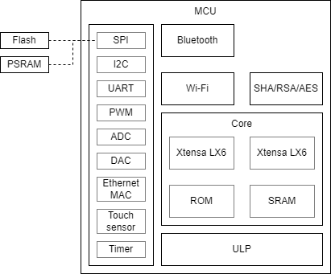
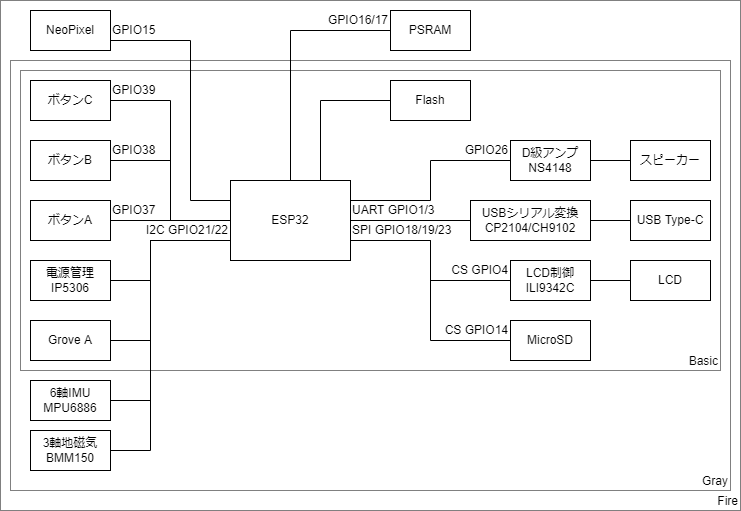
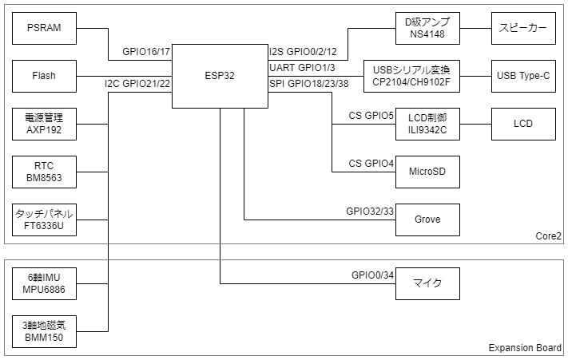
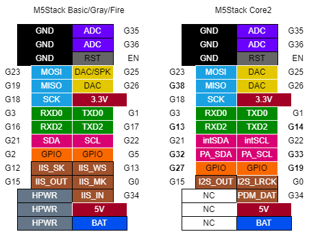
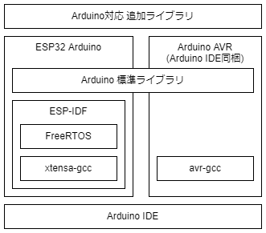

# イベント名札を電子化する本

## まえがき

## ESP32

中国Espressif社が開発したWi-Fi/Bluetooth内蔵の32bitマイコンで、非常に安価なことから2010年代後半以降の電子工作で多用される。

外付けFlashとアンテナを組み込んだモジュールが市場に出回っており、日本国内でも工事設計認証 (技適) 取得済みのものが数百円で入手できる。

- CPU: Xtensa LX6 (32bit/160MHz 1コアまたは240MHz 2コア)
- SRAM: 520KB
- Flash: 4/8/16MB (外付け)
- 外付けPSRAM対応
- 2.4GHz 無線
  - IEEE 802.11 b/g/n
  - Bluetooth BR/EDR + Bluetooth Low Energy
- 駆動電圧: 3.3V



Espressifからはチップに加え、周辺部品を組み込み済のモジュールが発売されている。
代表的な製品は2コア版である次の2種類。
価格差が少ないことから1コア版はあまり使われない。

- ESP32-D0WD: 基本となるチップ。現在は改良版のESP32-D0WD-V3が発売
  - ESP32-WROOM-32: 外付けFlashと水晶振動子を内蔵し、アンテナ (または端子) を備えたモジュール
  - ESP32-WROVER: ESP32-WROOMに加え、PSRAMを内蔵したモジュール
- ESP32-PICO-D4: 外付けFlashと水晶振動子を内蔵したSiP (Silicon in Package)

Webサイトにはドキュメント (英語/中国語) が数多く公開されている。
本書はデータシートを参照して執筆しているが、改訂の頻度も高いので各自で最新の資料を参照されたし。

### ペリフェラル

直訳では**周辺機器**だが、マイコンの世界では内蔵の入出力機能のことをいう。

#### GPIO (General-Purpose Input/Output)

マイコンの最も基本的なペリフェラルで、HIGH/LOWのデジタル入出力を行う機能。
ESP32ではGPIO0～19, 21～23, 25～27, 32～39の34本を備える。
GPIO34～39は入力専用で、それ以外は入出力どちらにも対応しており内蔵プルアップ/プルダウン抵抗も使用できる。

各GPIOあたり20mA (ESP-IDFでは5, 10, 20, 30mAから変更可能) 、各Power Domainあたり合計で40mAまでドライブすることが可能。
したがってLEDを点灯させる程度であればGPIOの電流でも事足りる。

いくつかのGPIOは起動モード選択用に使用されており、**GPIO0をLOWで、かつGPIO2をLOWにして**起動するとプログラム書き込みモードで起動する。
GPIO12をHIGHにして起動するとFlashに1.8Vが供給され、通常組み込まれる3.3V駆動のFlashは動作できず起動できない。
この3つのGPIOは何も繋がずオープンにしておくのが無難。
またGPIO34～39は入力専用である。

後述のI2C, SPI, UARTなどのペリフェラルはGPIOマトリクスを経由してGPIOピンへ接続されているため、どのGPIOピンにも割り当てることができる。

#### I2C (Inter-Integrated Circuit)

SCL (シリアルクロック) と SDA (シリアルデータ) の2本の信号線で半二重通信を実現する規格。
通信速度は100～400kbpsと遅く配線も長くするのには向かないので、主に基板上のチップ間の接続に用いられる。

なんといっても信号線の少なさが利点であり、7bitのアドレスでスレーブを識別することから1つのマスターに対し複数のスレーブを接続することができる (アドレスが被るスレーブは同一系統に接続できない)。
SCLとSDAは共にプルアップしておく必要がある。
ESP32では `I2C0`, `I2C1` の2系統を持つ。

名称から、I2Cの「2」は上付きで表記する。
「アイツーシー」と読まれることも多いが、**「アイスクエアドシー」が正確な読み**である。

#### SPI (Serial Peripheral Interface)

SCL (シリアルクロック), MISO (マスターイン/スレーブアウト), MOSI (マスターアウト/スレーブイン), SS (スレーブセレクト、CS (チップセレクト) とも) の4本の信号線を用いた全二重通信が可能な規格。
I2C同様基板上のチップ間での通信に用いられる規格だが、こちらは1～2Mbpsの速度が出せる。
あのSDカードもSPIのインターフェースを備えている。

1つのマスターからSCL, MISO, MOSIは複数のスレーブに接続可能だが、SSはスレーブの数だけ別々に接続する。
SSのHIGH/LOWで通信相手を識別するので、I2Cのアドレス指定のような動作は必要ない。

ESP32は `SPI`, `HSPI`, `VSPI` の3系統のSPIを持っている。
`SPI` は外付けFlash (とPSRAM) の接続に使用しており、他の用途には使用できない。

#### UART (Universal Asynchronous Receiver/Transmitter)

単に**シリアル通信**と呼ばれるものの一種で、RX (受信) TX (送信) の2本の通信線で通信する。
PCの世界では同様の通信方式がRS-232Cにて使用されてきた (RS-232C = UARTではない。論理レベルや論理値が異なる)。

フロー制御用の信号としてDTR, RTSも用意されているが使用しなくても動作する。
クロック信号を使った同期を取らず誤り検出の機能も持たない (ソフトウェア上で対応することはできる) ので、受信データが化けたり欠落することもある。
通信速度は9600bps～115.2kbpsが多く使われているが、ハードウェアが速度に追い付くのであればそれ以上でも通信できる。

仕組みが簡単なこともあってマイコンには今でも当たり前のように搭載されているが (USBが使えるマイコンも勿論存在するが、規格が複雑で制御はかなり難しくなる)、PCでは使われなくなってきて久しく (PCでも機器の設定や制御を行う用途ではまだ現役で、産業用途で多用される)、**USBシリアル変換IC**を介して接続することがほとんどである (このUSBシリアル変換ICがまた癖のあるもので、FT232が最も安定するものの比較的高価。次点でCP210xで、その他CH340、PL2303など。偽物が出回っている、モジュールの設計ミスで3.3V出力に高い電圧が出る、ドライバが不安定、Windows 10用のドライバが無い製品がまだ出回っている、Webサイトが中国語のみ、など中々混沌としている)。
ESP32では `UART0`, `UART1`, `UART2` の3系統を備える。

#### ADC (Analog-Digital Conveter)

アナログ電圧入力を一定範囲の値へ変換する。
ESP32では分解能12bit (0～4095) のADCを2系統合わせて18ch (8ch + 10ch) 備える。
使用できるGPIOピンは固定されている。

#### DAC (Digital-Analog Converter)

ADCとは逆の役割で、一定範囲の値からアナログ電圧出力へ変換する。
音声出力などの用途で使用される。

ESP32では8bit (0～255) 出力のDACを2ch備え、GPIO25, GPIO26で使用できる。

#### PWM (Pulse Width Modulation)

日本語では**パルス幅変調**といい、任意の周波数とデューティ比 (HIGHを出力する時間の比率) でHIGH/LOW出力を切り替える機能。
HIGHの電圧を出力しながらもデューティ比の変更で平均電圧を制御できるので、動作に一定以上の電圧を求められる (=DACで出力した電圧では動かせない) モータの速度やLEDの明るさ制御などで使用される。

ESP32では16chのPWM出力を持ち、デューティ比は0 (0%) ～ 256 (100%) の範囲で設定する。
周波数の分解能は16bitで、ベースクロックが80MHzなので `80 [kMz] / 2 ^ 16 [bit] = 1.2207 [kHz]` まで下げられる。

### Wi-Fi

ESP32では2.4GHz帯のIEEE 802.11b/g/nに対応する。

### Bluetooth

レジ本から抜粋

## M5Stack

中国M5Stack社が発売しているマイコンボードで、ESP32に予め周辺部品を接続してプラスチック製ケースに収めているのが特徴。
電子工作でありがちなハードウェア回りの設計と調達で悩む必要がなく、買ってきたままの構成でプログラムを書くだけでIoTプロトタイピングを始められ、丈夫なケースに入っているのでそのまま実運用に持っていくことができる。

製品化のペースが非常に早く、毎週のように新商品が発売されている。
ロット変更で公式Webサイトでの予告なしに仕様変更が入ることもあるが、元々ESP32は日本での人気が高く、M5Stackも早期から日本市場との交流を続けてきたので個人ブログやTwitterなどでの日本語の情報も比較的多い。

### 本体

Core、Module、Bottomの三層構造になっており、CoreとBottomの間にModuleを重ねる (Stack) と電気的にも接続される構造をとっている。
このおかげで半田付けもブレッドボードも不要で機能を拡張できる。

- Core: MCU、LCD、周辺部品などがケースに収められたモジュール。
  - 最低限必要な部品は全てCoreに収まっているので、ModuleやBottomがなくても動作はする。
- Module: 電源、通信などの機能を収めたモジュール。
  - ユニバーサル基板が付いたProto Moduleが販売されており、自作の回路をModule化することもできる。
- Bottom: LiPoバッテリが収められた底面モジュール。

本体はCore + Bottomのセットで販売されている。
どれを買ったら良い? というと甲乙付けがたいが、単体であれこれするならCore2、電子部品と繋いでいじるならBasicとの価格差も少ないGrayではないだろうか (結局あとから買い増しして揃うのがM5Stack沼である)。

#### Basic/Gray/Fire

初期からある本体。
周辺部品の違いで3種類用意されている。
半導体不足の影響でUSBシリアル変換ICが変更されたものはリビジョンが変わっている (それ以前もIMUやLCDなどが変更されているが、品番も変わらず予告もなかった)。

比較的価格が安く、他の電子部品と接続しやすいなど後発のCore2と棲み分けがなされており、執筆時点に至るまで併売されている。

- Basic: 基本的な製品。
  - 150mAhのLiPoバッテリが装着されたBattery Bottomが装着されている。M-BUSの配線がピンヘッダ/ピンソケットが引き出されており、付属のジャンパワイヤでブレッドボード等と接続できる。
- Gray: BasicにIMU (BMM150 + MPU6886) が加えられた上位版。
- Fire: Grayに加えてMCUにPSRAMが接続されている。Grove B/CポートとNeoPixel付きのM5GO Bottomが装着されている。



#### Core2

全面的に刷新された本体で、MCUはFireと同様にPSRAMが接続されている。
外部接続端子はM-BUSとGrove互換ポートのみで、内蔵部品やGroveモジュールを動かす用途に向く。
M-BUSにはIMU (BMM150 + MPU6886) とマイクが搭載された子基板が装着済み。

LiPoバッテリは390mAhへ増量しており、Coreの底面と面一になる専用のBottomが付属する。

Grove互換ポートが `GPIO32`/`GPIO33` へ変更されており、I2C以外にGPIOなど各種ペリフェラルを割り当てて使用できるようになっている。
このためI2Cを使用する際は `GPIO21`/`GPIO21` へ割り当てられた `I2C` とは別系統になり、`I2C1` を割り当てる。

緑色LEDと振動モータは電源管理IC AXP192を経由で接続されている。
これらはAXP192のAPIを使用して制御できる。



### 入手先

#### 国内

- スイッチサイエンス
  - 日本国内での総代理店。
  - 千石電商、マルツパーツ館、共立電子など、スイッチサイエンス製品の取り扱いがある電子部品店では実店舗での購入も可能。
- 秋月電子通商
  - 並行輸入品扱いで一部商品の取り扱いがある。

Amazonなどの大手通販サイトでも出品がみられるが、正規ルートではないので購入は自己責任。

#### 個人輸入

決済、配送事故などのトラブルがあっても自力での交渉が求められる。
購入は自己責任で。

- M5Stack社 直販
  - m5stack-store
  - AliExpress M5Stack Official Store
- 正規代理店
  - DigiKey
  - Mouser

M5Stack社の直販窓口で購入すると中国から発送される。
直販サイトは外国人向けの窓口なので中国語スキルは必要なく、何かあっても翻訳サービスを使って英文のメールが読み書きできれば最低限の対応はできる。
配送方法はいくつかの選択肢から選ぶことができる。
輸送規制の厳しいリチウムイオン電池を含むのもあってか、送料が安価なeパケット (国際書留) を利用するとシンガポール経由となるようで、3～4週間を要する。
送料が高額な国際宅配便のDHLを利用するとさすがに早く、1週間前後で届く。

AliExpressなどでは他の業者も出品しているが、やはり正規ルートではないので自己責任となる。

DigiKeyとMouserは極めて多品種の電子部品を取り扱う通販業者で、かつメーカー公認で正規品を確実に入手できる。
日本向けの窓口があるので、日本語のメールで相談を受けてもらえる。
全てアメリカからの発送 (このためか輸出規制が厳しく、購入時に用途を聞かれる。注文内容によっては審査が入り、発送が遅れることもある) となるものの (競合他社のRSコンポーネンツは日本にも倉庫がある。ただしM5Stackの取り扱いはない)、国際宅配便を利用することから4日前後と非常に早く届く反面送料が高額。
マルツではDigiKey商品の取り寄せが可能なので、送料無料 (DigiKeyで6000円) に届かないときはマルツ経由で注文する方が安く済む。

### ペリフェラル

#### GPIO

M5Stackでは内蔵部品と外部入出力へ多くのGPIOが予め割り当てられており、自由に使えるGPIOは多くない。
自由に使用できるGPIOをリストアップする。

|GPIO|使用可否|備考|
|--:|:--:|:--|
|5|○||
|13|○||
|15|△|M5GO Bottom内蔵のNeoPixelが使用|
|16|△|PSRAMを使用していなければOK|
|17|△|PSRAMを使用していなければOK|
|26|○||
|35|△|入力専用|
|36|△|入力専用|

Core2では回路とM-BUSのピンアサインが変更されており、使えるGPIOが異なる。

|GPIO|使用可否|備考|
|--:|:--:|:--|
|13|○||
|14|○||
|19|○||
|25|△|M5GO Bottom2内蔵のNeoPixelが使用|
|27|○||
|32|△|Grove互換ポートと接続|
|33|△|Grove互換ポートと接続|
|35|△|入力専用|
|36|△|入力専用|

#### I2C

`I2C0` を周辺チップとの接続のほか、Grove互換ポートとも共有している。
Core2ではGrove互換ポートのピン配置が変更され、I2C以外でも使用できるようになった。

#### SPI

`VSPI` をLCDとSDカードへの接続に使用している。

#### UART

`UART0` がUSBシリアル変換IC (CP2104またはCH9102) と接続された状態で設定済で、USBで接続したPCと送受信できる。
`UART1`, `UART2` はRX, TXを自分で割り当ててから使用する。

#### M-BUS



背面にはM5Stack独自のM-BUSが引き出されている。

Basic/Gray/FireとCore2ではピンアサインが異なり、**太字**で示したピンが変更されている。
概ね互換性が考慮されているが、Core2では `PA_SDA` と `PA_SCL` (Grove互換ポートと接続) が増え、`GPIO` の配置がずれている。
その分I2Sのピン数が減っている。

## 環境構築

### ESP32 Arduino



Atmel (現: Microchip) AVR等のマイコンボードである**Arduino**での開発環境をAPI互換でESP32へ移植したもので、開発元のEspressif自らメンテナンスしており、利用者も多い。

Arduino IDEへインストールして使用する設計で、Arduinoの開発経験があれば違和感なく使用できる。
一方でTimerなど一部のAPIは非互換で別個に用意されている。
後述のESP-IDFの上で動作しており、足りない機能があってもESP-IDFのAPIをそのまま呼び出して使用できる。

プログラミング言語は、公式には**Arduino言語**と称している。

```cpp
// グローバル変数等はここに記述

void setup()
{
    // 起動時に一度だけ実行する処理
}

void loop()
{
    // setup() 関数実行後、繰り返し実行する処理
}
```

実体はC++そのもので、`.ino` 形式の**スケッチ** (Arduinoではプログラムをこう呼ぶ) に `Arduino.h` をincludeする処理をくっつける。
マイコンの種類ごとに用意された、`main()` 関数を実行するコードと一緒にビルドする仕組みとなっている。

```cpp
#include <Arduino.h>

int main(void)
{
    // マイコンの初期化処理が入る

    setup();

    for(;;)
    {
        loop();
    }
}
```

これにより、C/C++や組み込み開発特有の泥臭い処理を隠蔽している。

ホビー用ということもあってブレークポイントやレジスタ・メモリマップといった本格的なデバッグ機能は使用できず、`Serial.println()` 関数などを用いたいわゆる**printfデバッグ**で対処する (Visual Micro Arduino for Visual Studio (https://www.visualmicro.com/) を使用すると本格的なデバッグが可能)。

#### インストール

`https://www.arduino.cc/en/software` から最新版のArduino IDEをダウンロードする。
インストーラでは特に設定する項目もないので、実行してからは指示通りに進めていけば問題ない。
インストーラは英語だが、ソフトウェア自体は日本語表示に対応している。

インストール直後のArduino IDEにはESP32 Arduinoは入っていないので、こちらのインストールを進める。
まずは `ファイル` -> `環境設定` を開き、**追加のボードマネージャのURL**に `https://raw.githubusercontent.com/espressif/arduino-esp32/gh-pages/package_esp32_index.json` を入力して `OK` で閉じる。

続いて `ツール` -> `ボード` -> `ボードマネージャ` を開き、検索窓で `esp32` と検索してインストールする。
新規開発であれば2.0.xでほとんど問題ないが、過去のプログラムやライブラリを使用する場合は2.0.xでは動作せず、1.0.xを使わざるを得ないときもある。
なお複数バージョンの同居はできず、別のバージョンをインストールすると今まで使用していたバージョンは削除される。

- ESP32 Arduino 1.0.x: ESP-IDF 3.2/3.3
- ESP32 Arduino 2.0.x: ESP-IDF 4.4

#### 基本的な使い方

`ツール` -> `ボード` -> `ESP32 Arduino` からマイコンボードを選択する。
目的のボードが一覧に無いときは**ESP32 Dev Module**を選んでおくと素のESP32として開発できる。

予め作成済みの `setup()` (起動時に一度だけ実行) と `loop()` (`setup()` 以後繰り返し実行) 関数の中に処理を書いていく。
Arduino IDEのエディタは色が変わる程度の機能しかないので、あまり凝ったプログラムを書くには適していない。
サンプルコードは `ファイル` -> `スケッチ例` に収録されている。

コードファイルは、保存ダイアログで決めた名前で作成したフォルダの中に同名の `.ino` 形式で保存される (フォルダ名と同じでなければならない)。
C/C++の知識があるならincludeで読ませる前提のファイル分割も可能で、`.ino` のディレクトリ以下に `.h`、`.c`、`.cpp` などの形式で保存しておけばよい。

プログラムを書き込む時は `ツール` -> `シリアルポート` から接続先のシリアルポートを選択しておき、`スケッチ` -> `マイコンボードに書き込む` を実行すると、ビルドを実行して成功できればマイコンボードへ書き込まれる。
書き込みを行わず、ビルドだけする時は `スケッチ` -> `検証・コンパイル` を選ぶ。

シリアル通信で送受信するデータは `ツール` -> `シリアルモニタ` を開いて確認できる。
もちろん好みのシリアル通信モニタを用いても構わないが、プログラムの転送前には予め切断しておかないと書き込みに失敗する。

#### ライブラリ

ひとまとまりの機能を実現するプログラムは、モジュール単位にして**ライブラリ**として配布されている。
ソフトだけで完結する機能だけでなく、電子部品と通信して使うためのライブラリも作られている。

ライブラリを使うときは `スケッチ` -> `ライブラリをインクルード` から目的のライブラリを選ぶとincludeされる。

ライブラリのインストールや更新は `スケッチ` -> `ライブラリをインクルード` -> `ライブラリを管理` を開いて行う。
多数のライブラリをインストールしていると結構な頻度で更新が入るので、随時チェックされたし。

Arduinoは利用者が多く、著名な電子部品に対し何かしらのライブラリが出回っているのが大きな強みである。
一覧にライブラリがない部品でもGitHubなどを探すと見つかることも多い (ライセンスを確認して使用すること)。

### その他の開発環境

#### Espressif IoT Devalopment Framework

ESP32公式の開発環境で、全ての機能を使用できる。
C/C++で開発し (APIはC言語)、FreeRTOS上で動作する。

Pythonスクリプトをコマンドラインで実行して操作する開発環境だが、EclipseベースのIDEが用意されているほか、VSCode用の拡張機能もある。
FTDI FT232HをJTAGとして使用するとブレークポイントを張るデバッグにも対応する。

細かな動作ができる反面、ESP32 Arduinoと比べて格段に敷居が高い。
ドキュメントとサンプルコードが充実しているので、組み込み開発の知識がある、最新の機能をいち早く使用したい方は挑戦してほしい。

#### PlatformIO

Arduinoに似た環境で、最初から複数種類のマイコンとプラットフォームから選んで使用する前提で作られている。

VSCodeに拡張機能をインストールして使用する。
Arduino for VSCodeとは競合するので、インストールするのはどちらかにしておく。

#### UI Flow

M5Stack向けの開発環境。
ESP32をMicroPythonインタプリタとして動作させ、Wi-Fi経由でプログラムを転送する仕組み。
Webブラウザ上での開発が可能で、ブロックを組み立ててプログラムを設計するビジュアルプログラミングにも対応している。

筆者はArduinoで書けるので使用する機会がないのだが、Pythonが分かる方はこちらを使ってみるのも手。

## 部材選定

### M5Stack Basic/Gray/Fire/Core2

M5Stack本体を購入する。
これがなければ始まらない。

今回のプログラムはプリプロセッサマクロでBasic/Gray/FireとCore2向けを切り替えてビルドできるようにコーディングしており、いずれも使用できる。

### Proto Module

M-BUSピンソケット/ピンヘッダ取り付け済みのユニバーサル基板がケースに装着されたModule。

ケースの上下には予め小さなが穴2つずつ、大きな穴 (ケーブルを通すためのもの) が1つずつ開けられている。
側面にはスリットも開けられている。

### M5GO Bottom

NeoPixel (10個)、赤外LED、赤外線センサを内蔵し、Grove互換ポートB (GPIO) / C (UART) が引き出された拡張用のBottom。
600mAhの比較的大きなLiPoバッテリを内蔵しており、単なる大容量バッテリとしても使用できる (その代わり、Battery Bottomには備わるピンヘッダ/ピンソケットは無い)。
底面には電源 (とI2C) 端子が引き出されていて、別売のM5GO/Fire チャージベースに付いているポゴピンを介し、CoreにUSBケーブルを接続せずに充電できる。
元々はM5Stack Fire / M5GO IoT スターターキットの付属品だが、単品販売もされている。

M5GO Bottomを含む**初期に発売されたModuleやBaseではM-BUSピンヘッダの長さが2mmのため、そのままではCore2とは接続できない**と称されている。
Core2用にはM-BUSピンヘッダの長さが2.5mmに変更され、ピン配置の変更に対応したM5GO Bottom2 (子基板が取り付けられない問題を解決するため、IMUとマイクも搭載) が用意されており、そちらの使用が推奨されている。

ところが、筆者はProto Moduleを間を挟むことでM-BUSピンヘッダの長さ問題を解決し、手持ちの初代M5GO Bottomを流用してしまっている。

### 組み立て

前述のM5Stack関連部材のほか、名札にするために吊り下げ用の部材を揃える。
いずれもホームセンターや100円ショップで容易に入手できるものなので、各自入手いただきたい。

今回はM5Stack関連部材の加工は安価なProto Moduleのみにとどめ、Core2などは無加工で済ませる。
ここで紹介する組み付け手順もあくまで一例なので、各自工夫されたし。

- キャップボルト (M3): 4個
- ヒートン: 2個
- ナスカン: 2組
- 吊り下げ紐
  - 吊り下げ名札ごと購入し、名札部分を外して紐だけ拝借する方が入手しやすいかもしれない。

ヒートン2個をProto Module上部の小さな穴にねじ込んでいく。
Core2の子基板をマイナスドライバー等でこじって先に外し、キャップボルトを外して付属Bottomを取り外す (このとき基板からバッテリ端子を外す)。
そしてCore2 + Proto Module + M5GO Bottomの順に重ねる。
このままではM-BUSの差し込みだけで固定された状態で取れやすいので、四隅をキャップボルトで締める。
締めすぎると表面のガラスパネルが浮いてきて最悪割れるので、浮き上がらないか確認しながら締め付けトルクを調整する。

吊り下げ紐にはナスカン2組を通しておき、名札として使用する時に環を開けてヒートンに通す。
これで紐が不要なときは環を開けて取り外せるし、逆の手順を踏んでProto Moduleを外せばCore2を完全に元の状態に戻せる。

## プログラム

### 使用ライブラリ

#### M5Stack/M5Core2

M5Stack社公式のライブラリ。
Basic/Core/FireではM5Stackライブラリを、Core2ではM5Core2ライブラリをincludeする。

周辺部品を利用するためのライブラリが同梱され、呼び出しやすいようにAPIがまとめられている。

#### ArduinoJson

ArduinoでJSONファイルを読み書きするためのライブラリで、AVRマイコンのほか、ESP32やCortex-Mなどで動作する。

組み込み向けに開発されており、使用するメモリをすべて静的に確保できるように配慮されている。

#### LovyanGFX

ESP32 (ESP8266/ATSAMD51にも対応) とSPI, I2C, 8bitパラレル接続液晶用のライブラリ。
液晶制御用のライブラリはM5Core2ライブラリにもTFT_eSPIが同梱されているが、チューニングが行われており高速に動作する。

日本語の表示には予め自分でフォントセットを用意する必要があったTFT_eSPIライブラリとは異なり、IPAフォントとefontからコンバートされた日本語フォントが同梱されている。
日本語フォントは文字数が多くプログラム肥大化の要因になる。
本プログラムでは16, 24, 32, 40pxの4サイズのIPAフォントを読み込ませており、Flashが4MBの機種ではパーティションスキームが標準のDefault 4MB with spiffs (1.5MB x2/1MB SPIFFS) では不足するので (OTA (Over The Air) 機能でWi-Fi経由のプログラム書き換えを実現するため、プログラム領域が2分割されている。読み書きは片方のみ行う仕組み) 、Huge APP (3MB No OTA/1MB SPIFFS) へ変更する (OTAは使えなくなる)。
Flashが16MBの機種ではパーティションスキームに16MB Flash (3MB APP/9MB FATFS) が選べ、こちらへ変更するとプログラム領域を賄えてかつOTAにも対応する。

#### Adafruit NeoPixel

RGB LEDにマイコンを内蔵していて、制御信号を送り込んで任意の色で発光できるLED。
複数のNeoPixelを数珠繋ぎに接続することが可能で、少ない配線でまとめて制御できる。
オリジナルはWorldSemi社製だが各社から互換品が発売されている。

内蔵のマイコンはWorldSemi社製で、5V駆動品は大きく分けて2種類ある。
M5GO Baseの内蔵品はWS2812のようである。
これらと同等の機能を持ったクローン品を搭載したLEDも流通している。

- WS2812
  - 入力から先頭のRGB色データ (24bit) を受け取り、以降は出力に繋がれたLEDへ流す
- WS2822
  - 割り振られたアドレスに対応するRGB色データを受け取る

制御信号はマイコンからGPIO出力をソフトウェアで操作すれば十分で、I2CやSPIを使用する必要はない。
Arduino環境ではAdafruit Neopixelライブラリを使用すると容易に制御できる。

#### Adafruit SHT31

Senrision社製温湿度センサSHT31用のライブラリ。
Adafruit製モジュール向けに作られているが、他社製モジュールでも問題なく利用できる。
国内の電子部品店で入手できる (Amazon マーケットプレイスやAliExpressなどでも出品がある。玉石混交なので自己責任で)。

- Adafruit SHT31-D搭載 温湿度センサモジュール (スイッチサイエンス扱い: https://www.switch-science.com/catalog/3348/)
- 秋月電子 SHT31使用 高精度温湿度センサモジュール (https://akizukidenshi.com/catalog/g/gK-12125/)

オプションとして温度・湿度表示の機能を組み込んでおり、プリプロセッサマクロでコンパイル条件を設定している。
使用する時は `config.h` のコメントアウトを外して `#define ENABLE_SHT31` を有効してからビルドする。

### コーディング

<!-- ヘッダファイル 一箇所にまとめて記述 -->

#### JSON読み込み

まずは `StaticJsonDocument<N>` インスタンスを確保する。
匿名 `namespace` ブロック内に記述すると他のソースファイルから呼び出せなくなる (C言語の関数外 `static` と同じ)。

```cpp
namespace {
    StaticJsonDocument<4096> json_document;
}
```

`SD.open()` 関数でSDカードに保存されたJSONファイルを開くと `File` 型オブジェクトを取得できるので、 `deserializeJson()` 関数でデシリアライズする。
`json_document` には展開済のデータが格納されるので、あとはエラーチェックを済ませる。

```cpp
File json_file = SD.open("/settings.json");
DeserializationError error = deserializeJson(json_document, json_file);

if (error != DeserializationError::Ok)
{
    Serial.println("JSON Deserialization Error");
    return;
}
```

JSONを解析したデータを扱いやすくするため、`Settings` クラスを作成してこちらから操作することにした。

インスタンスを `Settings::fromJson()` 関数へ渡して `Settings` 型のインスタンスを生成する。
`Color` 型、`Menu` 型、`LED` 型、`Image` 型といった `const` メンバ変数を持つクラスはコピーコンストラクタが自動生成されておらず、**インスタンスの再代入ができない** (コピーコンストラクタを自分で定義すれば再代入は可能だが、`const` メンバ変数の値は書き換えできない)。
したがって `Settings` 型のインスタンスも再代入できないので、`.ino` ファイル内でグローバル変数を予め宣言してもそこへ値を代入することができない。
そこで、`new` 演算子を使ってメモリを動的に確保して、ポインタを介してインスタンスを扱う。

`TextElement` 型は複数個存在しうるので、インスタンスをSTL (Standard Template Libraryの略。テンプレートを活用したC++標準ライブラリ) コンテナ `std::vector<T>` 型へ範囲 `for` 文を使って格納していく。

```cpp
// settings.cpp (抜粋)
Settings* Settings::fromJson(JsonDocument& json_document)
{
    JsonVariant json_foreground = json_document["foreground"];
    Color foreground = Color::fromJson(json_foreground);

    JsonVariant json_background = json_document["background"];
    Color background = Color::fromJson(json_background);

    JsonVariant json_menu = json_document["menu"];
    Menu menu = Menu::fromJson(json_menu);

    JsonVariant json_led = json_document["led"];
    LED led = LED::fromJson(json_led);

    JsonVariant json_image = json_document["image"];
    Image image = Image::fromJson(json_image);

    JsonArray json_array = json_document["text"].as<JsonArray>();
    std::vector<TextElement> text_elements;

    text_elements.reserve(json_array.size());

    for (JsonObject json_element: json_array)
    {
        text_elements.push_back(TextElement::fromJson(json_element));
    }

    JsonVariant json_qrcode = json_document["qrcode"];
    QRCode qrcode = QRCode::fromJson(json_qrcode);

    return new Settings(foreground, background, menu, led, image, text_elements, qrcode);
}
```

```cpp
Color Color::fromJson(JsonVariant& json_color)
{
    const uint8_t red = json_color[0];
    const uint8_t green = json_color[1];
    const uint8_t blue = json_color[2];

    return Color(red, green, blue);
}
```

`Menu` 型インスタンスの生成は `static` 関数 `Menu::fromJson()` で行う。

```cpp
// menu.cpp (抜粋)
Menu Menu::fromJson(JsonVariant& json_menu)
{
    JsonVariant json_foreground = json_menu["foreground"];
    const Color foreground = Color::fromJson(json_foreground);

    JsonVariant json_background = json_menu["background"];
    const Color background = Color::fromJson(json_background);

    return Menu(foreground, background);
}
```

`LED` 型インスタンスの生成は `static` 関数 `LED::fromJson()` で行う。

```cpp
// led.cpp (抜粋)
LED LED::fromJson(JsonVariant& json_led)
{
    JsonVariant json_color = json_led["color"];
    const Color color = Color::fromJson(json_color);

    const LEDPattern pattern = static_cast<LEDPattern>(json_led["pattern"].as<uint8_t>());

    return LED(color, pattern);
}
```

`Image` 型インスタンスの生成は `static` 関数 `Image::fromJson()` で行う。

```cpp
// image.cpp (抜粋)
Image Image::fromJson(JsonVariant& json_image)
{
    const int32_t x = json_image["x"];
    const int32_t y = json_image["y"];
    String src = json_image["src"];

    return Image(x, y, src);
}
```

`TextElement` 型インスタンスの生成は `static` 関数 `TextElement::fromJson()` で行う。

```cpp
// text-element.cpp (抜粋)
TextElement TextElement::fromJson(JsonObject& json_element)
{
    const int32_t x = json_element["x"];
    const int32_t y = json_element["y"];
    const TextSize size = static_cast<TextSize>(json_element["size"].as<uint8_t>());
    String text = json_element["text"];

    JsonVariant json_foreground = json_element["foreground"];
    JsonVariant json_background = json_element["background"];
    const Color foreground = Color::fromJson(json_foreground);
    const Color background = Color::fromJson(json_background);

    return TextElement(x, y, size, text, foreground, background);
}
```

```cpp
// qrcode.cpp (抜粋)
QRCode QRCode::fromJson(JsonVariant& json_qrcode)
{
    const int32_t x = json_qrcode["x"];
    const int32_t y = json_qrcode["y"];
    const int32_t width = json_qrcode["width"];
    String url = json_qrcode["url"];

    return QRCode(x, y, width, url);
}
```

#### ループ処理

`loop()` 関数内に処理を書き、 `delay()` 関数で指定時間分処理を止める手法がよく紹介されている。
ループの周期は**処理時間 + `delay()` 関数での待機時間**となり一定間隔での実行が保証されず、また待機中は他の処理も一切できない。

そこで、ハードウェアで実装されたTimerを利用して、指定の間隔で**実行中の処理を中断して別の処理を実行する**タイマー割り込みを使用する。
こうすると実行間隔が保証されるというわけである。
ESP32 Arduinoのタイマー割り込みはArduino標準ライブラリのそれとは互換性がなく、ESP32 Arduinoの `Ticker` クラスを使用する。

処理によっては `loop()` 関数内でなければうまく動かないこともあるので、そのような場合は両者を使い分ける。
`M5.update()` 関数はTimer割り込み内に書いても特に問題はないようである。

ブロック外でインスタンスを生成し (匿名 `namespace` 内に入れている)、`setup()` 関数で周期 (ミリ秒) とコールバック関数 (`void (*)(TArg)` 型のテンプレート関数ポインタ型で、**コンパイル時に関数のアドレスが確定する**グローバル関数と `static` メンバ関数を与えられる。非 `static` なメンバ関数はインスタンスを生成するまで関数のアドレスが定まらないので不可) を与える `attach_ms()` 関数を実行する。
あとはコールバック関数のブロック内に処理を記述していく。

```cpp
namespace {
    Ticker ticker;
    // 略
}

void setup()
{
    // 略
    ticker.attach_ms(100, onTimerTicked);
}

void onTimerTicked()
{
    // ここにループ処理を記述
}
```

今回はコールバック内に処理をすべて移しても問題なかったので、`loop()` 関数を空にすることができた。

#### ボタン/タッチパネル押下状態取得

ループ処理内で `M5.update()` 関数を実行した後の行で関数を用いて取得できる。
いずれも `bool` 型で返るので、`if` 文で分岐させてあげればよい。

```cpp
if (M5.btnA.wasPressed())
{
    // ボタン押下時の処理
}
```

ボタンごとに別々のインスタンスが用意されているので、目的のボタンに合わせたものを指定する。
Core2ではLCD下部の **○** の部分をボタンの判定として、Basic/Gray/Fireと同じコード取得することもできる。

- `BtnA`: 左ボタン
- `BtnB`: 中央ボタン
- `BtnC`: 右ボタン

ボタン押下状態を取得する関数はいくつか用意されている (箇条書き以外にもある)。
`wasPressed()` は再び押した時、`wasReleased()` は再び離した時まで呼び出されないので、イベントを取る時には便利である。

- `isPressed()`: **押している間** `true`
- `isReleased()`: **離している間** `true`
- `wasPressed()`: **押した時** `true`
- `wasReleased()`: **離した時** `true`

##### M5Stack Core2 タッチパネル

Core2ではタッチパネルとなっていて `M5.Touch.getPressPoint()` 関数で `TouchPoint` 型の座標を取得できる。
また `M5.Touch.isPressed()` で領域関係なしにタッチ状態か否かを取得することも可能で、本プログラムでも電源管理IC経由で接続されている内蔵LEDとバイブレータを制御している。

```cpp
// タッチ中LED消灯
if (M5.Touch.ispressed())
{
    setLed(false);
    vibrateOn();
}
else
{
    setLed(true);
    vibrateOff();
}
```

`vibrateOn()`、`vibrateOff()`、`setLed()` 関数はこのように定義している。

```cpp
void vibrateOn()
{
    M5.Axp.SetLDOEnable(3, true);
}

void vibrateOff()
{
    M5.Axp.SetLDOEnable(3, false);
}

void setLed(bool is_on)
{
    M5.Axp.SetLed(is_on);
}
```

#### LCD描画

すべてLovyanGFXで描画する。
まずは匿名 `namespace` 内で `LGFX` 型のインスタンスを作成する。

```cpp
LGFX lcd;
```

`setup()` 関数内で `init()` 関数を実行してLCDを初期化する。

```cpp
lcd.init();
```

##### LCD消去

モードの切替等でLCDの描画内容を消去する `Settings::clearLCD()` 関数を用意する。

```cpp
// settings.cpp (抜粋)
void Settings::clearLCD()
{
    // LCDクリア
    _lcd->fillScreen(_background.getRGB888());
}
```

##### コンテンツ描画

設定を `Settings` 型のインスタンスへ格納しているので、こちらに描画関数を定義した。
`Settings::showCommon()` でモード共通の表示 (テキストと電池アイコン)、`Settings::showImage()` 関数で画像、 `Settings::showQR()` 関数でQRコードを描画する。
いずれも表示内容が更新されるものではないので、**起動直後とモード切り替え直後のみ描画すればよい**。

```cpp
// settings.cpp (抜粋)
void Settings::showCommon()
{
    // 共通表示
    for (TextElement& text_element: _text_elements)
    {
        text_element.show(_lcd);
    }

    _menu.show(_lcd);

    // 電池アイコン
    _lcd->fillRect(10, 7, 15, 10, _foreground.getRGB888());
    _lcd->fillRect(25, 10, 3, 4, _foreground.getRGB888());
}

void Settings::showImage()
{
    // 画像表示
    _image.show(_lcd);
}

void Settings::showQR()
{
    // QRコード表示
    _qrcode.show(_lcd);
}
```

テキストはメンバ関数 `TextElement::show()` で描画する。
ここでは座標を指定して描画する `LGFX::drawString()` 関数を使用している。
他に `LGFX::setCursor()` 関数でカーソルの座標を指定し、カーソルを移動させながら描画する `LGFX::print()` ないし `LGFX::println()` (カーソルが改行される) 関数も用意されている。

`LGFX::drawString()` などの前に設定用の関数を実行すると文字列の描画設定を変更できる。

- `LGFX::setFont()` 関数: フォントの設定
- `LGFX::setTextColor()` 関数: 色の設定 (文字色、背景色)
- `LGFX::setTextDatum()` 関数: 文字列を描画する原点の位置

LovyanGFXでは `fonts` クラスに日本語対応のフォントが複数組み込まれており、フォントデータを作成しなくてもすぐに使える。
これらはコードで参照した状態でビルドすると組み込まれ、プログラムサイズが大きくなっていく。
本プログラムでは4サイズ収録しているが、前述の通りその代償として4MB Flashの製品では標準のパーティションスキームでは容量不足でビルドできないので、設定を変更しておく。

```cpp
// text-element.cpp (抜粋)
void TextElement::setFont(LGFX* const lcd)
{
    const lgfx::v0::IFont* font;

    switch(_size)
    {
        case TextSize::Size16:
            font = &fonts::lgfxJapanGothic_16;
            break;
        case TextSize::Size32:
            font = &fonts::lgfxJapanGothic_32;
            break;
        case TextSize::Size40:
            font = &fonts::lgfxJapanGothic_40;
            break;
        default:
            font = &fonts::lgfxJapanGothic_24;
    }

    lcd->setFont(font);
}

void TextElement::show(LGFX* const lcd)
{
    setFont(lcd);
    lcd->setTextColor(_foreground.getRGB888(), _background.getRGB888());
    lcd->drawString(_text, _x, _y);
}
```

```cpp
// image.cpp (抜粋)
void Image::show(LGFX* const lcd)
{
    // 拡張子ごとに分岐
    if (_src.endsWith(extension_bmp))
    {
        lcd->drawBmpFile(SD, _src, _x, _y);
    }
    else if (_src.endsWith(extension_png))
    {
        lcd->drawPngFile(SD, _src, _x, _y);
    }
    else if (_src.endsWith(extension_jpg))
    {
        lcd->drawJpgFile(SD, _src, _x, _y);
    }
}
```

```cpp
// qrcode.cpp (抜粋)
void QRCode::show(LGFX* const lcd)
{
    lcd->qrcode(_url, _x, _y, _width, 6);
}
```

```cpp
// menu.cpp (抜粋)
void Menu::show(LGFX* const lcd)
{
    // 背景
    lcd->fillRect(0, 216, 320, 24, _background.getRGB888());

    // 文字
    lcd->setFont(&fonts::lgfxJapanGothic_24);
    lcd->setTextColor(_foreground.getRGB888(), _background.getRGB888());
    lcd->setTextDatum(TC_DATUM);
    
    lcd->drawString("LED", 60, 216);
    lcd->drawString("輝度", 160, 216);
    lcd->drawString("QR", 260, 216);

    lcd->setTextDatum(TL_DATUM);

    // 枠
    lcd->drawRect(20, 216, 80, 24, _foreground.getRGB888());
    lcd->drawRect(120, 216, 80, 24, _foreground.getRGB888());
    lcd->drawRect(220, 216, 80, 24, _foreground.getRGB888());
}
```

##### 電池残量・温湿度取得

電池残量の取得は、Basic/Gray/Fire (25%/50%/75%/100%/-1% (取得不能) 表示) とCore2 (電圧表示) では電源管理ICが異なるのでAPIも異なる。
これらはプリプロセッサマクロを利用して適合するものをコンパイルするように条件を設ける。
取得した値はLCDへ描画する。

SHT31を接続している時は温度と湿度を取得してLCDへ描画する。
こちらもプリプロセッサマクロを利用してコンパイル条件を設ける。

こちらは常時更新される内容なので、 `Settings::update()` 関数に定義して、ループ処理から呼び出す。

```cpp
// settings.cpp (抜粋)
void Settings::update()
{
    // 更新
    // テキスト色指定等
    _lcd->setTextColor(_foreground.getRGB888(), _background.getRGB888());
    _lcd->setTextDatum(TL_DATUM);
    // バッテリ残量
    #ifdef BOARD_M5CORE
        // 電池残量
        int8_t battery_level = M5.Power.getBatteryLevel();
        _lcd->drawString(String(battery_level) + "%", 40, 0);
    #endif
    #ifdef BOARD_M5CORE2
        // 電圧
        float voltage = M5.Axp.GetBatVoltage();
        _lcd->drawString(String(voltage) + "V", 40, 0);
    #endif
    #ifdef ENABLE_SHT31
        // 温湿度
        const float temperature = _sht31->readTemperature();
        const float humidity = _sht31->readHumidity();
        _lcd->drawString(String(temperature, 0) + "℃, " + String(humidity, 0) + "％", 40, 24);
    #endif
    // LED
    _led.update(_neopixel);
}
```

#### LED点灯

M5GO Bottomに内蔵のNeoPixelを点灯させてみる。
色や点灯パターンはJSONを解析して `LED` 型のインスタンスへ格納する。

最初に`Adafruit_NeoPixel::begin()` で初期化してから、`Adafruit_NeoPixel::setBrightness()` 関数で輝度を調整する。
LEDの色は `Adafruit_NeoPixel::showPixelColor()` 関数で設定できるが、1個ずつの設定なので全部設定するには `for` 文などでループを使用する。
最後に `Adafruit_NeoPixel::show()` 関数を実行してGPIOへ制御信号を出力する。

さらに、`LEDPattern` 列挙型で点灯パターンをいくつか用意して、 `LED::update()` 関数内で輝度制御をするコードを組み込んだ。

```cpp
// led.cpp (抜粋)
void LED::begin(Adafruit_NeoPixel* const neopixel)
{
    neopixel->begin();
}

void LED::update(Adafruit_NeoPixel* const neopixel)
{
    if (!_is_enabled)
    {
        // 無効
        _brightness_count = 0;
        _brightness_reverse = false;

        neopixel->setBrightness(0);
        neopixel->show();
        return;
    }

    // カウント
    _brightness_count++;

    // Patternによって変更
    switch (_pattern)
    {
        case LEDPattern::Blink:
            // 点灯/消灯
            if (_brightness_reverse)
            {
                _brightness = brightness_min;
            }
            else
            {
                _brightness = brightness_max;
            }
            // カウント上限のとき反転
            if (_brightness_count >= brightness_count_max)
            {
                _brightness_reverse = !_brightness_reverse;
            }
            break;
        case LEDPattern::Fade:
            // 明るさ変更
            if (_brightness_reverse)
            {
                _brightness--;
            }
            else
            {
                _brightness++;
            }
            // 上限/下限で反転
            if (_brightness <= brightness_min)
            {
                _brightness_reverse = false;
            }
            else if (_brightness >= brightness_max)
            {
                _brightness_reverse = true;
            }
            break;
        default:
            _brightness_reverse = false;
            _brightness = brightness_max;
            break;
    }

    // カウントリセット
    if (_brightness_count >= brightness_count_max)
    {
        _brightness_count = 0;
    }

    const uint32_t neopixel_color = neopixel->Color(_color.getRed(), _color.getGreen(), _color.getBlue());
    for (size_t i = 0; i < neopixel_num; i++)
    {
        neopixel->setPixelColor(i, neopixel_color);
    }
    neopixel->setBrightness(_brightness);
    neopixel->show();
}
```

#### 状態遷移

画像を描画する `ImageState` クラスと、QRコードを描画する `QRState` クラスとの遷移を管理する `StateManager` クラスを作成した。
両者は `IState` クラス (純粋仮想関数のみ) を継承しており、ポインタを `IState*` 型のメンバ変数に代入してポリモーフィズムを実現する。

`StateManager::begin()` 関数で初期化、`StateManager::update()` 関数で描画を更新する。
`StateManager::toggleState()` 関数を実行すると両者を切り替える。
これらは `.ino` ファイルのループ処理から呼び出す。

```cpp
// state-manager.cpp (抜粋)
void StateManager::begin(Settings* settings)
{
    _settings = settings;

    _state = &_image_state;
    _state->begin(_settings);
}

void StateManager::toggleState()
{
    if (_state == &_image_state)
    {
        _state = &_qr_state;
    }
    else
    {
        _state = &_image_state;
    }

    _state->begin(_settings);
}

void StateManager::update()
{
    _state->update();
}
```

```cpp
// image-state.cpp (抜粋)
void ImageState::begin(Settings* settings)
{
    _settings = settings;

    _settings->clearLCD();
    _settings->showImage();
    _settings->showCommon();
}
```

```cpp
// qr-state.cpp (抜粋)
void QRState::begin(Settings* settings)
{
    _settings = settings;

    _settings->clearLCD();
    _settings->showQR();
    _settings->showCommon();
}
```

#### その他

##### データ型

C/C++では組み込み型のサイズが処理系依存である。
例えば `int` と書いても多くの32bit環境 (x86, ARMなど) では4バイトだが、8bitマイコンのAVRへ移植すると2バイトであり、したがって変数の取りうる値の範囲も異なる。
これではソースを別の処理系へ流用した時に互換性が取れないので、サイズ別に分類した型の別名が `stdint.h` に定義されている。
組み込み開発では様々な処理系が存在することから、基本的に別名を使用してコーディングする。

|型の別名|**大半の**32bit処理系 <br /> での型名|説明|
|:--|:--|:--|
|`uint8_t`|`unsigned char`|8bit符号なし整数型|
|`int8_t`|`signed char`|8bit符号付き整数型|
|`uint16_t`|`unsigned short`|16bit符号なし整数型|
|`int16_t`|`short`|16bit符号付き整数型|
|`uint32_t`|`unsigned int`|32bit符号なし整数型|
|`int32_t`|`int`|32bit符号付き整数型|
|`uint64_t`|`unsigned long long`|64bit符号なし整数型|

- 組み込み型の `char` は、`unsigned char` か `signed char` のどちらであるかは処理系依存である。
- 実数型 (浮動小数点型) `float` や `double` は別名を使わない。
  - 別の問題として処理系によってはハードウェアで浮動小数点演算回路 (FPU) を持っておらず、ソフトウェア処理となり動作が遅くなる。

##### `const`

**実行時定数**で、メモリ上に領域が確保されるが解放されるまで値を変更できない。
メンバ変数に `const` 付きの型を持つクラスではコピーコンストラクタが削除されるので、一度生成したインスタンスへは `=` 演算子で他のインスタンスを代入できなくなる。

`const` 付きの型は `const` 無しの型とは別の型として扱われ、`const` を外すキャストは `const_cast` を用いる。

ポインタ型では `const` を付ける位置によって意味合いが変わってくる。

- `const uint8_t*`: ポインタの参照先の値が不変
- `uint8_t* const`: ポインタ値が不変
- `const uint8_t* const`: ポインタ値も、参照先の値も不変

##### `constexpr`

Constant Expression (定数式) の略で、C++11からサポートされた**コンパイル時定数**の仕様。
従来のC/C++では `#define` などのプリプロセッサマクロで定数を取り扱ってきたが、これはプリプロセッサがコンパイル前に単純にキーワードを置換する機能しかなく、展開後でなければコンパイラによるチェックを受けられず、特に関数マクロでは注意して記述しないと意図しない展開をされることもある。
スコープもないのでコード全体に適用されてしまい、キーワードが被ると目も当てられない状態になってしまう。

コンパイラが処理する定数 `constexpr` で、さまざまな制約が存在するが変数、関数、クラス定義などで使用できる。
当然ながら、コンパイラで展開されるテンプレートとも併用できる。
スコープを持つので影響範囲を制御できる。

##### C++形式のキャスト

C言語のキャストはポインタ型や `const` 型であれ括弧と型名でキャストできた。

```cpp
uint32_t hoge = 255;
uint8_t fuga = (uint8_t)hoge;
```

C++では型チェックが厳格化された上、用途によってキャストの種類が分かれている。
単純に値が入っている型を変更するだけの時は `static_cast` を用いる。

```cpp
uint32_t hoge = 255;
uint8_t fuga = static_cast<uint8_t>(hoge);
```

ポインタ型をキャストする時は `reinterpret_cast` を用いる。
別のポインタ型へ変換して扱うのは思わぬ動作を招く原因になりやすいので、プログラマを注意させるために長い名前になっている。

```cpp
using func = void (*)(uint8_t);

void foo(void* arg)
{

}

void bar(uint8_t arg)
{

}

void hoge()
{
    func fuga = bar;
    foo(reinterpret_cast<void*>(fuga));
}
```

`const` を外す時は `const_cast` を使用する。

```cpp
const uint32_t hoge = 0;
uint32_t fuga = const_cast<uint8_t>(hoge);
```

このほか実行時にキャストを試みる `dynamic_cast` も用意されているが、組み込み開発では実行時型情報 (RTTI) を無効化することが多いのでここでは割愛する。

## 動作確認

## あとがき
