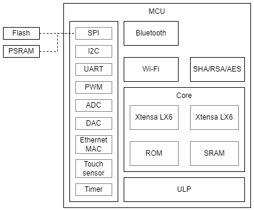
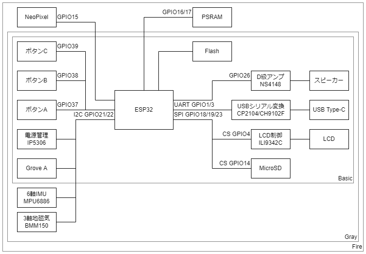

# イベント名札を電子化する本

## まえがき

## ESP32

中国Espressif社が開発したWi-Fi/Bluetooth内蔵の32bitマイコンで、非常に安価なことから2010年代後半以降の電子工作で多用される。

外付けFlashとアンテナを組み込んだモジュールが市場に出回っており、日本国内でも工事設計認証 (技適) 取得済みのものが数百円で入手できる。

- CPU: Xtensa LX6 (32bit/160MHz 1コアまたは240MHz 2コア)
- SRAM: 520KB
- Flash: 4/8/16MB (外付け)
- 外付けPSRAM対応
- 2.4GHz 無線
  - IEEE 802.11 b/g/n
  - Bluetooth BR/EDR + Bluetooth Low Energy
- 駆動電圧: 3.3V

Espressifからはチップに加え、周辺部品を組み込み済のモジュールが発売されている。
代表的な製品は2コア版である次の2種類。
価格差が少ないことから1コア版はあまり使われない。

- ESP32-D0WD: 基本となるチップ。現在は改良版のESP32-D0WD-V3が発売
  - ESP32-WROOM-32: 外付けFlashと水晶振動子を内蔵し、アンテナ (または端子) を備えたモジュール
  - ESP32-WROVER: ESP32-WROOMに加え、PSRAMを内蔵したモジュール
- ESP32-PICO-D4: 外付けFlashと水晶振動子を内蔵したSiP (Silicon in Package)

Webサイトにはドキュメント (英語/中国語) が数多く公開されている。
本書はデータシートを参照して執筆しているが、改訂の頻度も高いので各自で最新の資料を参照されたし。

### ペリフェラル

直訳では**周辺機器**だが、マイコンの世界では内蔵の入出力機能のことをいう。

#### GPIO (General-Purpose Input/Output)

マイコンの最も基本的なペリフェラルで、HIGH/LOWのデジタル入出力を行う機能。
ESP32ではGPIO0～19, 21～23, 25～27, 32～39の34本を備える。
GPIO34～39は入力専用で、それ以外は入出力どちらにも対応しており内蔵プルアップ/プルダウン抵抗も使用できる。

各GPIOあたり20mA (ESP-IDFでは5, 10, 20, 30mAから変更可能) 、各Power Domainあたり合計で40mAまでドライブすることが可能。
したがってLEDを点灯させる程度であればGPIOの電流でも事足りる。

いくつかのGPIOは起動モード選択用に使用されており、**GPIO0をLOWで、かつGPIO2をLOWにして**起動するとプログラム書き込みモードで起動する。
GPIO12をHIGHにして起動するとFlashに1.8Vが供給され、通常組み込まれる3.3V駆動のFlashは動作できず起動できない。
この3つのGPIOは何も繋がずオープンにしておくのが無難。
またGPIO34～39は入力専用である。

後述のI2C, SPI, UARTなどのペリフェラルはGPIOマトリクスを経由してGPIOピンへ接続されているため、どのGPIOピンにも割り当てることができる。

#### I2C (Inter-Integrated Circuit)

SCL (シリアルクロック) と SDA (シリアルデータ) の2本の信号線で半二重通信を実現する規格。
通信速度は100～400kbpsと遅く配線も長くするのには向かないので、主に基板上のチップ間の接続に用いられる。

なんといっても信号線の少なさが利点であり、7bitのアドレスでスレーブを識別することから1つのマスターに対し複数のスレーブを接続することができる (アドレスが被るスレーブは同一系統に接続できない)。
SCLとSDAは共にプルアップしておく必要がある。
ESP32では `I2C0`, `I2C1` の2系統を持つ。

名称から、I2Cの「2」は上付きで表記する。
「アイツーシー」と読まれることも多いが、**「アイスクエアドシー」が正確な読み**である。

#### SPI (Serial Peripheral Interface)

SCL (シリアルクロック), MISO (マスターイン/スレーブアウト), MOSI (マスターアウト/スレーブイン), SS (スレーブセレクト、CS (チップセレクト) とも) の4本の信号線を用いた全二重通信が可能な規格。
I2C同様基板上のチップ間での通信に用いられる規格だが、こちらは1～2Mbpsの速度が出せる。
あのSDカードもSPIのインターフェースを備えている。

1つのマスターからSCL, MISO, MOSIは複数のスレーブに接続可能だが、SSはスレーブの数だけ別々に接続する。
SSのHIGH/LOWで通信相手を識別するので、I2Cのアドレス指定のような動作は必要ない。

ESP32は `SPI`, `HSPI`, `VSPI` の3系統のSPIを持っている。
`SPI` は外付けFlash (とPSRAM) の接続に使用しており、他の用途には使用できない。

#### UART (Universal Asynchronous Receiver/Transmitter)

単に**シリアル通信**と呼ばれるものの一種で、RX (受信) TX (送信) の2本の通信線で通信する。
PCの世界では同様の通信方式がRS-232Cにて使用されてきた (RS-232C = UARTではない。論理レベルや論理値が異なる)。

フロー制御用の信号としてDTR, RTSも用意されているが使用しなくても動作する。
クロック信号を使った同期を取らず誤り検出の機能も持たない (ソフトウェア上で対応することはできる) ので、受信データが化けたり欠落することもある。
通信速度は9600bps～115.2kbpsが多く使われているが、ハードウェアが速度に追い付くのであればそれ以上でも通信できる。

仕組みが簡単なこともあってマイコンには今でも当たり前のように搭載されているが (USBが使えるマイコンも勿論存在するが、規格が複雑で制御はかなり難しくなる)、PCでは使われなくなってきて久しく (PCでも機器の設定や制御を行う用途ではまだ現役で、産業用途で多用される)、**USBシリアル変換IC**を介して接続することがほとんどである (このUSBシリアル変換ICがまた癖のあるもので、FT232が最も安定するものの比較的高価。次点でCP210xで、その他CH340、PL2303など。偽物が出回っている、モジュールの設計ミスで3.3V出力に高い電圧が出る、ドライバが不安定、Windows 10用のドライバが無い製品がまだ出回っている、Webサイトが中国語のみ、など中々混沌としている)。
ESP32では `UART0`, `UART1`, `UART2` の3系統を備える。

#### ADC (Analog-Digital Conveter)

アナログ電圧入力を一定範囲の値へ変換する。
ESP32では分解能12bit (0～4095) のADCを2系統合わせて18ch (8ch + 10ch) 備える。
使用できるGPIOピンは固定されている。

#### DAC (Digital-Analog Converter)

ADCとは逆の役割で、一定範囲の値からアナログ電圧出力へ変換する。
音声出力などの用途で使用される。

ESP32では8bit (0～255) 出力のDACを2ch備え、GPIO25, GPIO26で使用できる。

#### PWM (Pulse Width Modulation)

日本語では**パルス幅変調**といい、任意の周波数とデューティ比 (HIGHを出力する時間の比率) でHIGH/LOW出力を切り替える機能。
HIGHの電圧を出力しながらもデューティ比の変更で平均電圧を制御できるので、動作に一定以上の電圧を求められる (=DACで出力した電圧では動かせない) モータの速度やLEDの明るさ制御などで使用される。

ESP32では16chのPWM出力を持ち、デューティ比は0 (0%) ～ 256 (100%) の範囲で設定する。
周波数の分解能は16bitで、ベースクロックが80MHzなので `80 [kMz] / 2 ^ 16 [bit] = 1.2207 [kHz]` まで下げられる。

### Wi-Fi

ESP32では2.4GHz帯のIEEE 802.11b/g/nに対応する。

### Bluetooth

レジ本から抜粋

## M5Stack

M5Stackで遊ぶだけであればESP32の知識はあまり要求されないが、頭の片隅に置いておくとよい。

### 本体

#### Basic/Gray/Fire

- Basic: 基本的な製品。
- Gray: BasicにIMU (BMM150 + MPU6886) が加えられた上位版。
- Fire: Grayに加えてMCUにPSRAMが接続されている。Grove B/CポートとNeoPixel付きのM5Go Bottomが付属する。

#### Core2

全面的に刷新された本体で、MCUはFireと同様にPSRAMが接続されている。
外部接続端子はM-BUSとGrove互換ポートのみで、内蔵部品やGroveモジュールで動かす用途に向く。
M-BUSにはIMU (BMM150 + MPU6886) とマイクが搭載された基板が装着済み。

### 入手先

#### 国内

- スイッチサイエンス
  - 日本国内での総代理店。
  - 千石電商、マルツパーツ館、共立電子など、スイッチサイエンス製品の取り扱いがある電子部品店では実店舗での購入も可能。
- 秋月電子通商
  - 並行輸入品扱いで一部商品の取り扱いがある。

Amazonなどの大手通販サイトでも出品がみられるが、正規ルートではないので購入は自己責任。

#### 個人輸入

決済、配送事故などのトラブルがあっても自力での交渉が求められる。
購入は自己責任で。

- M5Stack社 直販
  - m5stack-store
  - AliExpress M5Stack Official Store
- 正規代理店
  - DigiKey
  - Mouser

M5Stack社の直販窓口で購入すると中国から発送される。
直販サイトは外国人向けの窓口なので中国語スキルは必要なく、何かあっても翻訳サービスを使って英文のメールが読み書きできれば最低限の対応はできる。
配送方法はいくつかの選択肢から選ぶことができる。
輸送規制の厳しいリチウムイオン電池を含むのもあってか、送料が安価なeパケット (国際書留) を利用するとシンガポール経由となるようで、3～4週間を要する。
送料が高額な国際宅配便のDHLを利用するとさすがに早く、1週間前後で届く。

AliExpressなどでは他の業者も出品しているが、やはり正規ルートではないので自己責任となる。

DigiKeyとMouserは極めて多品種の電子部品を取り扱う通販業者で、かつメーカー公認で正規品を確実に入手できる。
日本向けの窓口があるので、日本語のメールで相談を受けてもらえる。
全てアメリカからの発送 (このためか輸出規制が厳しく、購入時に用途を聞かれる。注文内容によっては審査が入り、発送が遅れることもある) となるものの (競合他社のRSコンポーネンツは日本にも倉庫がある。ただしM5Stackの取り扱いはない)、国際宅配便を利用することから4日前後と非常に早く届く反面送料が高額。
マルツではDigiKey商品の取り寄せが可能なので、送料無料 (DigiKeyで6000円) に届かないときはマルツ経由で注文する方が安く済む。

### ペリフェラル

#### GPIO

M5Stackでは内蔵部品と外部入出力へ多くのGPIOが予め割り当てられており、自由に使えるGPIOは多くない。
自由に使用できるGPIOをリストアップする。

|GPIO|使用可否|備考|
|--:|:--:|:--|
|5|○||
|13|○||
|15|△|M5GO Bottom内蔵のNeoPixelが使用|
|16|△|PSRAMを使用していなければOK|
|17|△|PSRAMを使用していなければOK|
|26|○||
|35|△|入力専用|
|36|△|入力専用|

Core2では回路とM-BUSのピンアサインが変更されており、使えるGPIOが異なる。

|GPIO|使用可否|備考|
|--:|:--:|:--|
|13|○||
|14|○||
|19|○||
|25|△|M5GO Bottom2内蔵のNeoPixelが使用|
|27|○||
|32|△|Grove互換ポートと接続|
|33|△|Grove互換ポートと接続|
|35|△|入力専用|
|36|△|入力専用|

#### I2C

`I2C0` を周辺チップとの接続のほか、Grove互換ポートとも共有している。
Core2ではGrove互換ポートのピン配置が変更され、I2C以外でも使用できるようになった。

#### SPI

`VSPI` をLCDとSDカードへの接続に使用している。

#### UART

`UART0` がUSBシリアル変換IC (CP2104またはCH9102) と接続された状態で設定済で、USBで接続したPCと送受信できる。
`UART1`, `UART2` はRX, TXを自分で割り当ててから使用する。
