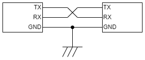
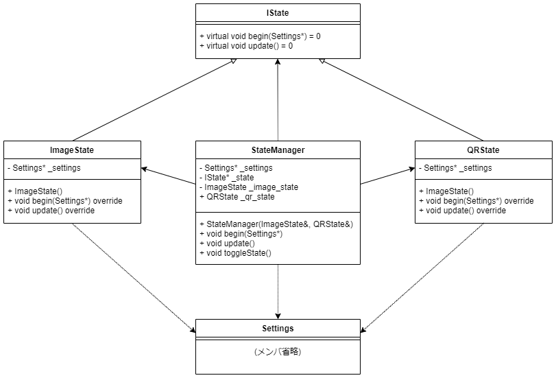

# イベント名札を電子化する本

## まえがき

「環境構築」「部材選定」「ビルド・書き込み」「動作確認」の順にお読み下さい。

## ESP32

ざっくりとESP32のデータシートを読んだので、機能の説明とともに仕様をまとめる。
ESP32 Arduino環境で開発する場合はハードウェアを意識することはあまり多くないが、頭の片隅においておくと何かあった時に役に立つ。

ESP32は中国Espressif社が開発したWi-Fi/Bluetooth内蔵の32bitマイコンで、非常に安価なことから2010年代後半以降の電子工作で多用される。

外付けFlashとアンテナを組み込んだモジュールが市場に出回っており、日本国内でも工事設計認証 (技適) 取得済みのものが数百円で入手できる。

- CPU: Xtensa LX6 (32bit/160MHz 1コアまたは240MHz 2コア)
- SRAM: 520KB
- Flash: 4/8/16MB (外付け)
- 外付けPSRAM対応
- 2.4GHz 無線
  - IEEE 802.11 b/g/n
  - Bluetooth BR/EDR + Bluetooth Low Energy
- 駆動電圧: 3.3V


Webサイトにはドキュメント (英語/中国語) が数多く公開されている。
本書はデータシートを参照して執筆しているが、改訂の頻度も高いので各自で最新の資料を参照されたし。

### 製品

Espressifからはチップに加え、周辺部品を組み込み済のモジュールが発売されている。
代表的な製品は2コア版である次の2種類。
価格差が少ないことから1コア版はあまり使われない。

#### チップ

単体チップのほか、SiP (Silicon in Package: Flashと水晶振動子といった外付け部品を内蔵したパッケージ) が用意されている。
ここでは主要な現行品を紹介する。

|型番|コア数|周波数 <br /> [MHz]|Flash <br /> [MB]|PSRAM <br /> [MB]|備考|
|:--|--:|--:|--:|--:|:--|
|ESP32-D0WD|2|240|外付け|外付け|基本版|
|ESP32-D0WD-V3|2|240|外付け|外付け|エラッタ改良版|
|ESP32-S0WD|1|160|外付け|外付け|ESP32-D0WDのシングルコア版|
|ESP32-PICO-D4|2|240|4|-|ESP32-D0WDをベースにしたSiP|
|ESP32-PICO-V3|2|240|4|-|ESP32-PICO-D4とほぼ同等のSiPだが、ピン配置が異なる|
|ESP32-PICO-V3-02|2|240|8|2|ESP32-PICO-V3からFlash増量/PSRAM搭載したSiP|

いずれもQFN (Quad Flat No-leads) パッケージなので手作業での半田付けは困難である。

#### モジュール

前述のチップに周辺部品を搭載して缶に収め、使いやすくしたモジュールが用意されている。

Espressifでは多種のモジュールを発売しているが、工事設計認証 (いわゆる技適) を取得しているモジュールは一部のみである。
本節では、現行品かつ工事設計認証取得済のモジュールを紹介する。

ESP32-WROOM-32D, ESP32-WROOM-32 (U), ESP32-SOLO-1, ESP32-WROVER- (I) B, ESP32-WROVER (-I)など旧製品はNRND (Not Recommended for New Design: 新規設計非推奨) となっている。

|型番|採用 <br /> チップ|Flash <br /> [MB]|PSRAM <br /> [MB]|アンテナ|備考|
|:--|:--|--:|--:|:--|:--|
|ESP32-WROOM-32E|ESP32-D0WD-V3|4/8/16|-|PCB||
|ESP32-WROOM-32UE|ESP32-D0WD-V3|4/8/16|-|IPEX||
|ESP32-WROVER-E|ESP32-D0WD-V3|4/8/16|8|PCB||
|ESP32-WROVER-IE|ESP32-D0WD-V3|4/8/16|8|IPEX||
|ESP32-PICO-V3-ZERO|ESP32-PICO-V3|4|-|PCB <br /> IPEX|ACK (Alexa Connect Kit) 開発専用

モジュールのランドは1.27mmピッチの表面実装なので、慣れていないと半田付けは難しい。
ホビーユースでは、評価ボードまたはモジュール実装済みの変換基板を使うと扱いやすい。
国内でもEspressif純正の評価ボードESP32-DevkitCなどを入手できる。

### ペリフェラル

直訳では**周辺機器**だが、マイコンの世界では内蔵の入出力機能のことをいう。

#### GPIO (General-Purpose Input/Output)

マイコンの最も基本的なペリフェラルで、HIGH/LOWのデジタル入出力を行う機能。
ESP32では34本を備える。

|GPIO|方向|Power Domain|Pull-up <br /> Pull-down|起動モード <br /> 選択に使用|
|--:|:--:|:--|:--:|:--:|
|0|入力/出力|VDD3P3_RTC|○|○|
|1|入力/出力|VDD3P3_CPU|○|-|
|2|入力/出力|VDD3P3_RTC|○|○|
|3|入力/出力|VDD3P3_CPU|○|-|
|4|入力/出力|VDD3P3_RTC|○|-|
|5|入力/出力|VDD3P3_CPU|○|○|
|6～11|入力/出力|VDD_SDIO|○|-|
|12|入力/出力|VDD3P3_RTC|○|○|
|13, 14|入力/出力|VDD3P3_RTC|○|-|
|15|入力/出力|VDD3P3_RTC|○|○|
|16, 17|入力/出力|VDD_SDIO|○|-|
|18, 19|入力/出力|VDD3P3_CPU|○|-|
|21～23|入力/出力|VDD3P3_CPU|○|-|
|25～27|入力/出力|VDD3P3_RTC|○|-|
|32, 33|入力/出力|VDD3P3_RTC|○|-|
|34～39|入力|VDD3P3_RTC|-|-|

入力専用のGPIO34～39を除き、入出力どちらにも対応しており内蔵プルアップ/プルダウン抵抗 (回路をオープンにして論理値がふらつくのを防ぐため、VDDとの間に挟んで電位をHIGHレベルに固定するための抵抗がプルアップ抵抗。逆にGNDとの間に挟んでLOWレベルに固定するための抵抗がプルダウン抵抗) も使用できる。


各GPIOあたり20mA (ESP-IDFでは5, 10, 20, 30mAから変更可能) 、各Power Domainあたり合計で40mAまでドライブすることが可能。
したがってLEDを点灯させる程度であればGPIOの電流でも事足りる。

いくつかのGPIOは起動モード選択用に使用されており、**GPIO0をLOWで、かつGPIO2をLOWにして**起動するとプログラム書き込みモードで起動する。
GPIO12をHIGHにして起動するとFlashに1.8Vが供給され、通常組み込まれる3.3V駆動のFlashは動作できず起動できない。
この3つのGPIOは何も繋がずオープンにしておくのが無難。

後述のI2C, SPI, UARTなどのペリフェラルはGPIOマトリクスを経由してGPIOピンへ接続されているため、どのGPIOピンにも割り当てることができる。

#### I2C (Inter-Integrated Circuit)

SCL (シリアルクロック) と SDA (シリアルデータ) の2本の信号線で半二重通信を実現する規格。
通信速度は100～400kbpsと遅く配線も長くするのには向かないので、主に基板上のチップ間の接続に用いられる。


なんといっても信号線の少なさが利点であり、**7bitのアドレス**でスレーブを識別することから1つのマスターに対し複数のスレーブを接続することができる (アドレスが被るスレーブは同一系統に接続できない)。
SCLとSDAは共にプルアップしておく必要があるが、ESP32などマイコン側にプルアップ抵抗を内蔵している環境では外付けする必要はない。
ESP32では `I2C0`, `I2C1` の2系統を持つ。

<!-- 信号仕様も書く? -->

名称から、I2Cの「2」は上付きで表記する。
「アイツーシー」と読まれることも多いが、**「アイスクエアドシー」が正確な読み**である。

#### SPI (Serial Peripheral Interface)

SCL (シリアルクロック), MISO (マスターイン/スレーブアウト), MOSI (マスターアウト/スレーブイン), SS (スレーブセレクト、CS (チップセレクト) とも) の4本の信号線を用いた全二重通信が可能な規格。
I2C同様基板上のチップ間での通信に用いられる規格だが、こちらは1～2Mbpsの速度が出せる。
あのSDカードもSPIのインターフェースを備えている。


1つのマスターからSCL, MISO, MOSIは複数のスレーブに接続可能だが、SSはスレーブの数だけ別々に接続する。
SSのHIGH/LOWで通信相手を識別するので、I2Cのアドレス指定のような動作は必要ない。

ESP32は `SPI`, `HSPI`, `VSPI` の3系統のSPIを持っている。
`SPI` は外付けFlash (とPSRAM) の接続に使用しており、他の用途には使用できない。

#### UART (Universal Asynchronous Receiver/Transmitter)

単に**シリアル通信**と呼ばれるものの一種で、RX (受信) TX (送信) の2本の通信線で一対一で通信する。
TXは相手側のRXに、RXは相手側のTXに接続する。
PCの世界では同様の通信方式がRS-232Cにて使用されてきた (RS-232C = UARTではない。論理レベルや論理値が異なる)。



フロー制御用の信号としてDTR, RTSも用意されているが使用しなくても動作する。
クロック信号を使った同期を取らず誤り検出の機能も持たない (ソフトウェア上で対応することはできる) ので、受信データが化けたり欠落することもある。
通信速度は9600bps～115.2kbpsが多く使われているが、ハードウェアが速度に追い付くのであればそれ以上でも通信できる。

仕組みが簡単なこともあってマイコンには今でも当たり前のように搭載されているが (USBが使えるマイコンも勿論存在するが、規格が複雑で制御はかなり難しくなる)、PCでは使われなくなってきて久しく (PCでも機器の設定や制御を行う用途ではまだ現役で、産業用途で多用される)、**USBシリアル変換IC**を介して接続することがほとんどである (このUSBシリアル変換ICがまた癖のあるもので、FT232が最も安定するものの比較的高価。次点でCP210xで、その他CH340、PL2303など。偽物が出回っている、モジュールの設計ミスで3.3V出力に高い電圧が出る、ドライバが不安定、Windows 10用のドライバが無い製品がまだ出回っている、Webサイトが中国語のみ、など中々混沌としている)。
ESP32では `UART0`, `UART1`, `UART2` の3系統を備える。

#### ADC (Analog-Digital Conveter)

アナログ電圧入力を一定範囲の値へ変換する。
ESP32では分解能12bit (0～4095) のADCを2系統合わせて18ch (8ch + 10ch) 備える。
使用できるGPIOピンは固定されている。

#### DAC (Digital-Analog Converter)

ADCとは逆の役割で、一定範囲の値からアナログ電圧出力へ変換する。
音声出力などの用途で使用される。

ESP32では8bit (0～255) 出力のDACを2ch備え、GPIO25, GPIO26で使用できる。

#### PWM (Pulse Width Modulation)

日本語では**パルス幅変調**といい、任意の周波数とデューティ比 (HIGHを出力する時間の比率) でHIGH/LOW出力を切り替える機能。
HIGHの電圧を出力しながらもデューティ比の変更で平均電圧を制御できるので、動作に一定以上の電圧を求められる (=DACで出力した電圧では動かせない) モータの速度やLEDの明るさ制御などで使用される。

ESP32では16chのPWM出力を持ち、デューティ比は0 (0%) ～ 256 (100%) の範囲で設定する。
周波数の分解能は16bitで、ベースクロックが80MHzなので `80 [MHz] / 2 ^ 16 [bit] = 1.2207 [kHz]` まで下げられる。

### Timer

CPUのクロックが指定した回数経過したらカウントして、指定したカウント数でトリガをかける機能である。
他の処理を中断して別の処理を実行する**割り込み**がトリガのかかるタイミングで発生するので、主に一定周期での実行が求められる用途に用いられる。

ESP32は64bitのTimerを4つ備える。
ベースクロックは80MHzなので、割り込み間隔 (秒) はディバイダ (1カウントに必要なクロック数 (2～65536)) と周期 (カウント数 (1 ～ 2 ^ 64 - 1)) を設定すると `80 [MHz] / (ディバイダ * 周期)` の式で決定される。

これとは別に、CPUのハングアップを検出するためのWatchdog Timerを備えている。

### 無線

#### Wi-Fi

ESP32では2.4GHz帯のIEEE 802.11b/g/nに対応する。
筆者が仕様を調べられていないので満足に説明できない。

#### Bluetooth

2.4GHz帯を使用する近距離無線通信の規格で、数十cm～数mのケーブルを使用していた比較的低速な周辺機器との接続を無線化するのが主な用途 (Wi-Fiより低速/近距離/省電力で、NFCよりは遠距離)。
**互換性のない2つの規格が共にBluetoothを名乗っている**ので、混同しないように注意されたい。

- Classic Bluetooth: 従来のBluetooth
  - BR + EDR (Basic Rate + Extended Data Rate) とも
  - BLEでの音声伝送 (LE Audio: Bluetooth 5.2以上が必須) は仕様が策定中のため、現行製品での音声伝送はBluetooth 4.0以上に対応していてもClassic Blluetoothを使用している
- Bluetooth Low Energy (BLE): Bluetooth 4.0で実装された規格。Classic Bluetoothとの互換性はない
  - BLEとClassic Bluetoothの両方に対応するDual Mode (旧Bluetooth SMART READY) のほか、BLEのみのSingle Mode (旧Bluetooth SMART) のチップも多く発売されている

ESP32はDual Modeで、BLEとClassic Bluetoothの同時利用にも対応する。

ESP32 ArduinoでのBLE開発に最低限必要な知識は、拙著「M5Stackで即売会レジを作る Ver 1.2」にて10ページほど割いて説明しているので、そちらを参照されたい。

## M5Stack

中国M5Stack社が発売しているマイコンボードで、ESP32に予め周辺部品を接続してプラスチック製ケースに収めているのが特徴。
電子工作でありがちなハードウェア回りの設計と調達で悩む必要がなく、買ってきたままの構成でプログラムを書くだけでIoTプロトタイピングを始められ、丈夫なケースに入っているのでそのまま実運用に持っていくことができる。

製品化のペースが非常に早く、毎週のように新商品が発売されている。
またロット変更で公式Webサイトでの予告なしに仕様変更が入ることもある。

元々ESP32は日本での人気が高く、M5Stackも早期から日本市場との交流を続けてきたので個人ブログやTwitterなどでの日本語の情報も比較的多い。

### 本体

Core、Module、Bottomの三層構造になっており、CoreとBottomの間にModuleを重ねる (Stack) と電気的にも接続される構造をとっている。
このおかげで半田付けもブレッドボードも不要で機能を拡張できる。

- Core: MCU、LCD、周辺部品などがケースに収められたモジュール。
  - 最低限必要な部品は全てCoreに収まっているので、ModuleやBottomがなくても動作はする。
- Module: 電源、通信などの機能を収めたモジュール。
  - ユニバーサル基板が付いたProto Moduleが販売されており、自作の回路をModule化することもできる。
- Bottom: LiPoバッテリが収められた底面モジュール。

重ねられた部材の取り外しは、右側面の隙間からマイナスドライバーを差し込んで分離する。
四隅にはネジ穴が開けられており、M3のキャップボルトと2.5mmの六角レンチで強く固定できる。 (一部のパーツに付属するほか、ボルトセットの販売もある)
さらにBottomには磁石が内蔵されていて、スチール面に貼り付けることができる。

本体はCore + Bottomのセットで販売されている。
どれを買ったら良い? というと甲乙付けがたいが、単体であれこれするならCore2、電子部品と繋いでいじるならBasicとの価格差も少ないGrayではないだろうか (結局あとから買い増しして全部揃うのがM5Stack沼である)。

#### 共通

CPUはデュアルコアのESP32 (Basic/Gray/Fireでは缶に収められてチップを直視できないが、おそらくESP32-D0WD。Core2はESp32-D0WD-V3) を搭載している。

表面には320x240の2インチLCDを備える。
ロットによってTN液晶とIPS液晶が存在するようである。
コントローラはSPI接続のILI9342を採用しており、これはメモリを内蔵しているので常時信号を送り込む必要はなく、制御する時にコマンドを送れば表示内容が保持される。

PCとはUSB Type-Cケーブルで接続し、内臓のUSBシリアル変換IC (CP2104またはCH9102F) 経由で通信する。
USBケーブルから給電されると自動的に起動し、電源OFFの操作をしてもリセットされて電源を切れないのは仕様。
半導体不足の影響でUSBシリアル変換ICが変更されたものはリビジョンが変わっている (それ以前もIMUやLCDなどが変更されているが、品番も変わらず予告もなかった)。

#### Basic/Gray/Fire

初期からある本体で、周辺部品の違いで3種類用意されている。
比較的価格が安く、他の電子部品と接続しやすいなど後発のCore2と棲み分けがなされており、執筆時点に至るまで併売されている。

- Basic: 基本的な製品。
  - 150mAhのLiPoバッテリが装着されたBattery Bottomが装着されている。M-BUSの配線がピンヘッダ/ピンソケットが引き出されており、付属のジャンパワイヤでブレッドボード等と接続できる。
- Gray: BasicにIMU (BMM150 + MPU6886) が加えられた上位版。
- Fire: Grayに加えてMCUにPSRAMが接続されている。Grove B/CポートとNeoPixel付きのM5GO Bottomが装着されている。

表面にはボタン3個を備えており、プログラムから自由に扱える。
スピーカーも内蔵しており、内蔵DACからアナログ信号でアンプ (NS4168) を通して接続されている。

電源スイッチは左側面にあり、1回押すと電源ON、動作中に1回押すとリセット、2回押すと電源OFFである。


#### Core2

全面的に刷新された本体で、MCUはFireと同様にPSRAMが接続されている。
外部接続端子はM-BUSとGrove互換ポートのみで、内蔵部品やGroveモジュールを動かす用途に向く。
M-BUSにはIMU (BMM150 + MPU6886) とマイク (SPM1423) が搭載された子基板が装着済み。

LiPoバッテリは390mAhへ増量しており、Coreの底面と面一になる専用のBottomが付属する。

Grove互換ポートが `GPIO32`/`GPIO33` へ変更されており、I2C以外にGPIOなど各種ペリフェラルを割り当てて使用できるようになっている。
このためI2Cを使用する際は `GPIO21`/`GPIO21` へ割り当てられた `I2C` とは別系統になり、`I2C1` を割り当てる。

表面のボタンはなくなり、代わりにLCD全体にタッチパネル (FT6336U) が搭載されている。
内蔵スピーカーとの接続が変更されていて、アンプ (NS4168) へは内蔵DACを使わずにI2Sで通信する。
このほかRTC (BM8563) も搭載している。

緑色LEDと振動モータは電源管理IC AXP192を経由で接続されている。
これらはAXP192のAPIを使用して制御できる。
電源スイッチもAXP192へ接続されていることから操作が変更されており、左側面の電源スイッチ長押しで電源ON/OFF、下側面のリセットスイッチでリセット操作を行う。


### 入手先

M5Stackは人気の高さからか品薄気味で、希望の商品が品切れになっているときもある。
多くは再生産がなされるので、しばらく待っていると在庫が回復する。
2021年以降は半導体不足の影響も受けており、USBシリアル変換ICの変更による品番変更を伴う仕様変更も行われている。

#### 国内

年々M5Stack社直販とのタイムラグが少なくなっていて、比較的新しい部材も入手しやすくなった。

- スイッチサイエンス (https://akizukidenshi.com/)
  - 日本国内での総代理店。
  - 千石電商、マルツパーツ館、共立電子など、スイッチサイエンス製品の取り扱いがある電子部品店にて実店舗での購入も可能。
- 秋月電子通商 (https://akizukidenshi.com/)
  - 並行輸入品扱いで一部商品の取り扱いがある。

Amazonなどの大手通販サイトでも出品がみられるが、正規ルートではないので購入は自己責任となる。

#### 個人輸入

決済、配送事故などのトラブルがあっても自力での交渉が求められる。
購入は自己責任で。

- M5Stack社 直販
  - m5stack-store (https://shop.m5stack.com/collections/)
  - AliExpress M5Stack Official Store (https://ja.aliexpress.com/store/911661199)
- 正規代理店
  - DigiKey (https://www.digikey.jp/)
  - Mouser (https://www.mouser.jp/)

M5Stack社の直販窓口で購入すると中国から発送される。
直販サイトは外国人向けの窓口なので中国語スキルは必要なく、何かあっても翻訳サービスを使って英文のメールが読み書きできれば最低限の対応はできる。
配送方法はいくつかの選択肢から選ぶことができる。
輸送規制の厳しいリチウムイオン電池を含むのもあってか、送料が安価なeパケット (国際書留) を利用するとシンガポール経由となるようで、3～4週間を要する。
送料が高額な国際宅配便のDHLを利用するとさすがに早く、1週間前後で届く。

AliExpressなどでは他の業者も出品しているが、やはり正規ルートではないので自己責任となる。

DigiKeyとMouserは極めて多品種の電子部品を取り扱う通販業者で、かつメーカー公認なので正規品を確実に入手できる。
日本向けの窓口があるので、日本語のメールで相談を受けてもらえる。
全てアメリカからの発送 (このためか輸出規制が厳しく、購入時に用途を聞かれる。注文内容によっては審査が入り、発送が遅れることもある) となるものの (競合他社のRSコンポーネンツは日本にも倉庫がある。ただしM5Stackの取り扱いはない)、国際宅配便を利用することから4日前後と非常に早く届く反面送料が高額。
マルツではDigiKey商品の取り寄せが可能なので、送料無料 (DigiKeyで6000円) に届かないときはマルツ経由で注文する方が安く済む。

### ペリフェラル

#### GPIO

M5Stackでは内蔵部品と外部入出力へ多くのGPIOが予め割り当てられており、自由に使えるGPIOは多くない。
自由に使用できるGPIOをリストアップする。

|GPIO|使用可否|備考|
|--:|:--:|:--|
|5|○||
|13|○||
|15|△|M5GO Bottom内蔵のNeoPixelが使用|
|16|△|PSRAMを使用していなければOK|
|17|△|PSRAMを使用していなければOK|
|26|○||
|35|△|入力専用|
|36|△|入力専用|

Core2では回路とM-BUSのピンアサインが変更されており、使えるGPIOが異なる。

|GPIO|使用可否|備考|
|--:|:--:|:--|
|13|○||
|14|○||
|19|○||
|25|△|M5GO Bottom2内蔵のNeoPixelが使用|
|27|○||
|32|△|Grove互換ポートと接続|
|33|△|Grove互換ポートと接続|
|35|△|入力専用|
|36|△|入力専用|

#### I2C

`I2C0` を周辺チップとの接続のほか、Grove互換ポートとも共有している。
Core2ではGrove互換ポートのピン配置が変更され、I2C以外でも使用できるようになった。

#### SPI

`VSPI` をLCDとSDカードへの接続に使用している。

#### UART

`UART0` がUSBシリアル変換IC (CP2104またはCH9102) と接続された状態で設定済で、USBで接続したPCと送受信できる。
`UART1`, `UART2` はRX, TXを自分で割り当ててから使用する。

#### M-BUS

背面にはM5Stack独自のM-BUSが引き出されている。


Basic/Gray/FireとCore2ではピンアサインが異なり、**太字**で示したピンが変更されている。
概ね互換性が考慮されているが、Core2では `PA_SDA` と `PA_SCL` (Grove互換ポートと接続) が増え、`GPIO` の配置がずれている。
その分I2Sのピン数が減っている。

## 環境構築

### ESP32 Arduino

リポジトリ: https://github.com/espressif/arduino-esp32

Atmel (現: Microchip) AVR等のマイコンボードである**Arduino** (https://www.arduino.cc/) での開発環境をAPI互換でESP32へ移植したもので、開発元のEspressif自らメンテナンスしていて利用者も多い。


Arduino IDEへインストールして使用する設計で、Arduinoの開発経験があれば違和感なく使用できる。
一方でTimerなど一部のAPIは非互換で別個に用意されている。
ESP32 Arduinoは後述のESP-IDFの上で動作しており (ESP-IDFはFreeRTOS上で動作する)、足りない機能があってもESP-IDFのAPIをそのまま呼び出して使用できる。

プログラミング言語は、公式には**Arduino言語**と称している。

```cpp
// グローバル変数等はここに記述

void setup()
{
    // 起動時に一度だけ実行する処理
}

void loop()
{
    // setup() 関数実行後、繰り返し実行する処理
}
```

実体はC++そのもので、`.ino` 形式の**スケッチ** (Arduinoではプログラムをこう呼ぶ) に `Arduino.h` をincludeする処理をくっつける。
マイコンの種類ごとに用意された、`main()` 関数を実行するコードと一緒にビルドする仕組みとなっている。

```cpp
#include <Arduino.h>

int main(void)
{
    // マイコンの初期化処理が入る

    setup();

    for(;;)
    {
        loop();
    }
}
```

これにより、C/C++や組み込み開発特有の泥臭い処理を隠蔽している。

本書では開発言語に関する説明は省略するので、初めての方はArduinoを解説書を、すでにArduinoに慣れている方はC/C++の解説書を手に取ることをお勧めする。
ESP32 ArduinoではベースのESP-IDFがSTL (Standard Template Library) を含むC/C++の標準ライブラリの多くを組み込んでおり、予備知識があると役に立つ。

ホビー用ということもあってブレークポイントやレジスタ・メモリマップといった本格的なデバッグ機能は使用できず、`Serial.println()` 関数などを用いたいわゆる**printfデバッグ**で対処する (Visual Micro Arduino for Visual Studio (https://www.visualmicro.com/) を使用すると本格的なデバッグが可能)。

#### インストール

M5Stack本体に同梱のマニュアルは内容が古い場合があり、その手順では最新のライブラリ等が入手できないことがある。
本書では執筆時点で現行の手順を示すが、更新されることもあるのでM5Stack公式サイトの情報も併せて参照されたい。

##### USBシリアル変換IC ドライバ

最初にUSBシリアル変換ICのドライバをインストールする。
**品番によってUSBシリアル変換ICが異なる** (**V2.6** が付く製品はCH9102Fを採用) ので、適切なドライバを入手する必要がある。

- CP2104: Silicon Labs (https://jp.silabs.com/developers/usb-to-uart-bridge-vcp-drivers)
- CH9102F: WCH (中国語) (http://www.wch.cn/products/CH9102.html)

インストールは画面の指示に従って進めれば問題ない。
M5StackをPCとUSBで接続した時にデバイスマネージャで**不明なデバイス**ではなく、**シリアルポート**として認識されれば完了。

##### Arduino IDE

`https://www.arduino.cc/en/software` から最新版のArduino IDEをダウンロードする。
インストーラでは特に設定する項目もないので、実行してからは指示通りに進めていけば問題ない。
インストーラは英語だが、ソフトウェア自体は日本語表示に対応している。

インストール直後のArduino IDEにはESP32 Arduinoは入っていないので、こちらのインストールを進める。
まずは `ファイル` -> `環境設定` を開き、**追加のボードマネージャのURL**に `https://raw.githubusercontent.com/espressif/arduino-esp32/gh-pages/package_esp32_index.json` を入力して `OK` で閉じる。

続いて `ツール` -> `ボード` -> `ボードマネージャ` を開き、検索窓で `esp32` と検索してインストールする。
新規開発であれば2.0.xでほとんど問題ないが、過去のプログラムやライブラリを使用する場合は2.0.xでは動作せず、1.0.xを使わざるを得ないときもある。
なお複数バージョンの同居はできず、別のバージョンをインストールすると今まで使用していたバージョンは削除される。

- ESP32 Arduino 1.0.x: ESP-IDF 3.2/3.3
- ESP32 Arduino 2.0.x: ESP-IDF 4.4

筆者は1.0.xの最終バージョンである1.0.6を用いて開発している。

#### 基本的な使い方

`ツール` -> `ボード` -> `ESP32 Arduino` からマイコンボードを選択する。
目的のボードが一覧に無いときは**ESP32 Dev Module**を選んでおくと素のESP32として開発できる。

予め作成済みの `setup()` (起動時に一度だけ実行) と `loop()` (`setup()` 以後繰り返し実行) 関数の中に処理を書いていく。
Arduino IDEのエディタは色が変わる程度の機能しかないので、あまり凝ったプログラムを書くには適していない。
サンプルコードは `ファイル` -> `スケッチ例` に収録されている。

コードファイルは、保存ダイアログで決めた名前で作成したフォルダの中に同名の `.ino` 形式で保存される (フォルダ名と同じでなければならない)。
C/C++の知識があるならincludeで読ませる前提のファイル分割も可能で、`.ino` のディレクトリ以下に `.h`、`.c`、`.cpp` などの形式で保存しておけばよい。

プログラムを書き込む時は `ツール` -> `シリアルポート` から接続先のシリアルポートを選択しておき、`スケッチ` -> `マイコンボードに書き込む` を実行すると、ビルドを実行して成功できればマイコンボードへ書き込まれる。
書き込みを行わず、ビルドだけする時は `スケッチ` -> `検証・コンパイル` を選ぶ。

シリアル通信で送受信するデータは `ツール` -> `シリアルモニタ` を開いて確認できる。
もちろん好みのシリアル通信モニタを用いても構わないが、プログラムの転送前には予め切断しておかないと書き込みに失敗する。

#### ライブラリ

ひとまとまりの機能を実現するプログラムは、モジュール単位にして**ライブラリ**として配布されている。
ソフトだけで完結する機能だけでなく、電子部品と通信して使うためのライブラリも作られている。

ライブラリを使うときは `スケッチ` -> `ライブラリをインクルード` から目的のライブラリを選ぶとincludeされる。

ライブラリのインストールや更新は `スケッチ` -> `ライブラリをインクルード` -> `ライブラリを管理` を開いて行う。
多数のライブラリをインストールしていると結構な頻度で更新が入るので、随時チェックされたし。

Arduinoは利用者が多く、著名な電子部品に対し何かしらのライブラリが出回っているのが大きな強みである。
一覧にライブラリがない部品でもGitHubなどを探すと見つかることも多い (ライセンスを確認して使用すること)。

### その他の開発環境

#### Espressif IoT Devalopment Framework

- リポジトリ: https://github.com/espressif/esp-idf
- ドキュメント: https://docs.espressif.com/projects/esp-idf/en/latest/esp32/

ESP32公式の開発環境で、全ての機能を使用できる。
C/C++で開発し (APIはC言語)、FreeRTOS上で動作する。

Pythonスクリプトをコマンドラインで実行して操作する開発環境だが、EclipseベースのIDEが用意されているほか、VSCode用の拡張機能もある。
FTDI FT232HをJTAGとして使用するとブレークポイントを張るデバッグにも対応する。

細かな制御ができる反面、ESP32 Arduinoと比べて格段に敷居が高い。
ドキュメントとサンプルコードが充実しているので、組み込み開発の知識がある、最新の機能をいち早く使用したい方は挑戦してほしい。

#### PlatformIO

https://platformio.org/

Arduinoに似た環境で、最初から複数種類のマイコンとプラットフォームから選んで使用する前提で作られている。

VSCodeに拡張機能をインストールして使用する。
Arduino for VSCodeとは競合するので、インストールするのはどちらかにしておく。

#### UI Flow

https://flow.m5stack.com/

M5Stack向けの開発環境。
ESP32をMicroPythonインタプリタとして動作させ、Wi-Fi経由でプログラムを転送する仕組み。
Webブラウザ上での開発が可能で、ブロックを組み立ててプログラムを設計するビジュアルプログラミングにも対応している。

筆者はArduinoで書けるので使用する機会がないのだが、Pythonが分かる方はこちらを使ってみるのも手。

## 部材選定

ハードウェアやソフトウェアの説明はここまでにして、これ以後は**M5Stackで電子化した吊り下げ名札**の制作について説明する。
組み立てに必要な部材は下記の通りである。

- M5Stack 本体 (どちらでもOK)
  - Basic/Gray/Fire
  - Core2
- Proto Module
- M5GO Bottom
- その他
  - M3 キャップボルト: 2個または4個
  - ヒートン 2個
  - ナスカン: 2組
  - 吊り下げ紐
- オプション (なくても動作する)
  - Senserion SHT31 温湿度センサモジュール

### M5Stack Basic/Gray/Fire/Core2

M5Stack本体を購入する。
これがなければ始まらない。

今回のプログラムはプリプロセッサマクロでBasic/Gray/FireとCore2向けを切り替えてビルドできるようにコーディングしており、どちらにも対応するようにした。

### Proto Module

M-BUSピンソケット/ピンヘッダ取り付け済みのユニバーサル基板がケースに装着されたModule。

ケースの上下には予め小さなが穴2つずつ、大きな穴 (ケーブルを通すためのもの) が1つずつ開けられている。
側面にはスリットも開けられている。

### M5GO Bottom

NeoPixel (10個)、赤外LED、赤外線センサを内蔵し、Grove互換ポートB (GPIO) / C (UART) が引き出された拡張用のBottom。
600mAhの比較的大きなLiPoバッテリを内蔵しており、単なる大容量バッテリとしても使用できる (その代わり、Battery Bottomには備わるピンヘッダ/ピンソケットは無い)。
底面には電源 (とI2C) 端子が引き出されていて、別売のM5GO/Fire チャージベースに付いているポゴピンを介し、CoreにUSBケーブルを接続せずに充電できる。
元々はM5Stack Fire / M5GO IoT スターターキットの付属品だが、単品販売もされている。

M5GO Bottomを含む**初期に発売されたModuleやBaseではM-BUSピンヘッダの長さが2mmのため、そのままではCore2とは接続できない**と称されている。
Core2用にはM-BUSピンヘッダの長さが2.5mmに変更され、ピン配置の変更に対応したM5GO Bottom2 (子基板が取り付けられない問題を解決するため、IMUとマイクも搭載) が用意されており、そちらの使用が推奨されている。

ところが、筆者はProto Moduleを間を挟むことでM-BUSピンヘッダの長さ問題を解決し、手持ちの初代M5GO Bottomを流用してしまっている。
この場合、`GPIO15` に接続されているNeoPixelがCore2では `GPIO2` に接続されるので、条件付きコンパイルでGPIOピンの設定を分岐させる。

### Senserion SHT31

Senserion社製の温湿度センサで、夏場の暑い即売会で室温と湿度を知りたいがために付けてみた。
プログラムはプリプロセッサマクロによる条件付きコンパイルで有効/無効の設定を出来るようにしたので、なくても動作する。

表面実装品だが足を2.54mmピッチのスルーホールへ引き出したモジュールが流通しており、国内の電子部品店でも入手できる (Amazon マーケットプレイスやAliExpressなどでも出品がある。玉石混交なので自己責任で)。

- Adafruit SHT31-D搭載 温湿度センサモジュール (スイッチサイエンス扱い: https://www.switch-science.com/catalog/3348/)
- 秋月電子 SHT31使用 高精度温湿度センサモジュール (https://akizukidenshi.com/catalog/g/gK-12125/)

モジュールはProto Moduleへ半田付けして、3.3V、SDA、SCL、GNDの4本を結線する。
このとき半田のヤニがセンサ本体の測定穴に飛ばないように、センサを裏向きにしての半田付けが推奨されている。
今回はSDAを `GPIO21`、SCLを `GPIO22` へ接続したが、Coreの種類によって使用するI2Cの系統が異なり、Basic/Gray/Fireでは `I2C` が、Core2では `I2C1` が割り当てられている (Core2では `I2C` をGrove互換ポートに接続された `GPIO32` / `GPIO33` へ割り当てることが想定されている)。
両方に対応させる時は条件付きコンパイルで分岐させる。

アドレスピンの接続によってI2Cアドレスが `0x44` または `0x45` のどちらかに決まるので、こちらも基板パターンに従って適切に結線するかオープンにする。

### 組み立て

前述のM5Stack関連部材のほか、名札にするために吊り下げ用の部材を揃える。
いずれもホームセンターや100円ショップで容易に入手できるものなので、各自入手いただきたい。

今回はM5Stack関連部材の加工は安価なProto Moduleのみにとどめ、Coreは無加工で済ませる。
ここで紹介する組み付け手順もあくまで一例なので、各自工夫されたし。

- M3 キャップボルト: 2個または4個
  - Basic/Gray/Fireは2個、Core2は4個
  - 構成によって必要な長さが変わるので、複数の長さを購入しておくとよい。
- ヒートン: 2個
- ナスカン: 2組
- 吊り下げ紐
  - 吊り下げ名札ごと購入し、名札部分を外して紐だけ拝借する方が入手しやすいかもしれない。

まずはヒートン2個をProto Module上部の小さな穴にねじ込んでいく。
次に、CoreとBattery Bottomの間をマイナスドライバー等でこじって分離する。
Core2では子基板をマイナスドライバー等でこじって外し、キャップボルトを外して付属Bottomを取り外す (このとき基板からバッテリ端子を外す)。
そしてCore + Proto Module + M5GO Bottomの順に重ねる。
このままではM-BUSの差し込みだけで固定された状態で取れやすいので、四隅をキャップボルトで締める。
締めすぎると表面のガラスパネルが浮いてきて最悪割れるので、浮き上がらないか確認しながら締め付けトルクを調整する。

吊り下げ紐にはナスカン2組を通しておき、名札として使用する時に環を開けてヒートンに通す。
これで紐が不要なときは環を開けて取り外せるし、逆の手順を踏んでProto Moduleを外せばCore2を完全に元の状態に戻せる。

## プログラム

本章では電子名札用のプログラムについて説明する。
表示内容の設定データをすべてMicroSDカード上に置くように設計しているので、表示内容の変更のためにプログラムを書き換えなくて済む。

ソースコードはGitHub上のリポジトリ (https://github.com/nnm-t/m5core2-visiting-card) にて公開している。
名札を使うだけならソースコードを入手して、本章を読み飛ばしても構わない。

### ビルド設定

`ツール -> ボード -> ESP32 Arduino` から使用するM5Stack Coreに合わせてボード設定を選択する。
本プログラムはフォント埋め込みの関係でサイズが大きいので、4MB FlashのBasic/Grayに限りPartition Schemeが `Default` では容量不足で書き込めず、`ツール -> Partition Scheme` から設定を変更する必要がある (16MB版であればFireの設定を流用すると `Default` でも書き込める。このときPSRAMは `Disabled` にしておく)。

- Basic/Gray: `M5Stack-Core-ESP32`
  - Partition Scheme: `No OTA (Large APP)`
- Fire: `M5Stack-FIRE`
  - Partition Scheme: `Default (2 x 6.5MB app, 3.6MB SPIFFS)` (デフォルト)
- Core2: `M5Stack-Core2`
  - Partition Scheme: `Default (2 x 6.5MB app, 3.6MB SPIFFS)` (デフォルト)

余談だが、`Default` のPartition Schemeではプログラム領域が2分割されており、OTA (Over The Air) 機能でWi-Fi経由のプログラム書き換えをサポートしている。
ここでは説明しないが、M5Stack/M5Core2ライブラリに同梱の `ArduinoOTA` ライブラリを使用すると実装できる。

### 使用ライブラリ

すべてArduino IDEのライブラリマネージャ経由で導入できる。

#### M5Stack/M5Core2

- M5Stack リポジトリ: https://github.com/m5stack/M5Stack
- M5Core2 リポジトリ: https://github.com/m5stack/M5Core2

M5Stack社公式のライブラリ。
Basic/Core/FireではM5Stackライブラリを、Core2ではM5Core2ライブラリをincludeする。

周辺部品を利用するためのライブラリが同梱され、呼び出しやすいようにAPIがまとめられている。

#### ArduinoJson

- Webサイト: https://arduinojson.org/
- リポジトリ: https://github.com/bblanchon/ArduinoJson

JSONとはJavaScript Object Notationの略で、テキストベースで構造化されたデータを表現するフォーマットである。
当初はその名の通りJavaScriptの世界で使われていたもので、現在では幅広い言語でライブラリが整備されている。
この手のフォーマットはCSVがよく知られているが、CSVでは2次元配列状の構造しか持てないのに対してJSONでは要素を何段も入れ子にしたり名前を付けることができる。
本書ではJSONのファイルフォーマットについては説明を省略する。

ArduinoJSONはArduinoでJSONを読み書きするためのライブラリで、AVRマイコンのほか、ESP32やCortex-Mなどで動作する。
組み込み向けに開発されており、使用するメモリをすべて静的に確保できるように配慮されている。

#### LovyanGFX

リポジトリ: https://github.com/lovyan03/LovyanGFX

ESP32 (ESP8266/ATSAMD51にも対応) とSPI, I2C, 8bitパラレル接続液晶用のライブラリ。
液晶制御用のライブラリはM5Core2ライブラリにもTFT_eSPIが同梱されているが、チューニングが行われており高速に動作する。

日本語の表示には予め自分でフォントセットを用意する必要があったTFT_eSPIライブラリとは異なり、IPAフォントとefontからコンバートされた日本語フォントが同梱されている。
ただし、文字数の多い日本語フォントを多数読み込むとプログラム肥大化の要因になる。

#### Adafruit NeoPixel

リポジトリ: https://github.com/adafruit/Adafruit_NeoPixel

マイコンを内蔵したRGB LEDで、制御信号を送り込んで任意の色で発光できる。
複数のNeoPixelを数珠繋ぎに接続することが可能で、少ない配線でまとめて制御できる。
オリジナルはWorldSemi社製だが、各社から同等の機能を持ったクローン品も流通している。

電子工作でよく使われる5V駆動品のNeoPixelは大きく分けて2種類ある。
M5GO Baseの内蔵品はWS2812/WS2812Bのようである。


- WS2812/WS2812B
  - マイコンのGPIO出力から入力DINへ送られた先頭のRGB色データ (24bit) のみを受け取り、以降のデータは出力DOUTへ繋がれた後段のNeoPixelへそのまま流す
  - WS2812では電源ピンがマイコン (VCC) とLED (VDD) の2つに分かれていたが、WS2812BでVDDに統合されている
- WS2822S
  - マイコンからアドレス指定に使うGPIO出力をアドレス入力ADRIへ接続し、アドレス出力ADROを後段のNeoPixelのADRIへ接続する。NeoPixelのアドレスは先頭から1、4、7、……、と3つ飛ばしで割り振られる
  - RGB色データ (24bit) はマイコンのGPIO出力から全てのNeoPixelのデータ入力DAIへ同時に送られ、自身のアドレスに対応するデータを受け取る
  - 電源ピンはマイコン (VCC) とLED (VDD) の2つに分かれている

マイコンのGPIOから出力する制御信号はソフトウェアで制御しても間に合い、特別な機能を使用する必要はない。
Arduino環境ではAdafruitが提供しているライブラリを使用すると容易に制御できる。

#### Adafruit SHT31

リポジトリ: https://github.com/adafruit/Adafruit_SHT31

Senrision社製温湿度センサSHT31用のライブラリ。
Adafruit製モジュール向けに作られているが、他社製モジュールでも問題なく利用できる。

### コーディング

ハードウェアと開発環境、ライブラリが揃ったので、この先はソフトウェアで具体的な処理を作り込んでいく。

紙面の都合上、ソースコードの掲載は原則としてソースファイルに記述する定義のみとした。
ヘッダファイルに記述する宣言などはリポジトリからソース一式を入手して確認いただきたい。

#### JSON読み込み

まずは `StaticJsonDocument<N>` インスタンスを確保する。
匿名 `namespace` ブロック内に記述すると他のソースファイルから呼び出せなくなる (C言語の関数外 `static` と同じ)。

```cpp
namespace {
    StaticJsonDocument<4096> json_document;
}
```

`SD.open()` 関数でSDカードに保存されたJSONファイルを開くと `File` 型オブジェクトを取得できるので、 `deserializeJson()` 関数でデシリアライズする。
`json_document` には展開済のデータが格納されるので、あとはエラーチェックを済ませる。

```cpp
File json_file = SD.open("/settings.json");
DeserializationError error = deserializeJson(json_document, json_file);

if (error != DeserializationError::Ok)
{
    Serial.println("JSON Deserialization Error");
    return;
}
```

JSONを解析したデータを扱いやすくするため、`Settings` クラスを作成してこちらから操作することにした。

インスタンスを `Settings::fromJson()` 関数へ渡して `Settings` 型のインスタンスを生成する。
`Color` 型、`Menu` 型、`LED` 型、`Image` 型といった `const` メンバ変数を持つクラスはコピーコンストラクタが自動生成されておらず、**インスタンスの再代入ができない** (コピーコンストラクタを自分で定義すれば再代入は可能だが、`const` メンバ変数の値は書き換えできない)。
したがって `Settings` 型のインスタンスも再代入できないので、`.ino` ファイル内でグローバル変数を予め宣言してもそこへ値を代入することができない。
そこで、`new` 演算子を使ってメモリを動的に確保して、ポインタを介してインスタンスを扱う。

`TextElement` 型は複数個存在しうるので、インスタンスをSTLコンテナ `std::vector<T>` 型へ範囲 `for` 文を使って格納していく。

- `foreground`: 文字色 (`Color` 型)
- `background`: 背景色 (`Color` 型)
- `menu`: メニュー (`Menu` 型)
- `led`: LED (`LED` 型)
- `image`: 画像 (`Image` 型)
- 配列
  - `text`: 文字列要素 (`TextElement` 型)
- `qrcode`: QRコード (`QRCode` 型)

```cpp
// settings.cpp (抜粋)
Settings* Settings::fromJson(JsonDocument& json_document)
{
    JsonVariant json_foreground = json_document["foreground"];
    Color foreground = Color::fromJson(json_foreground);

    JsonVariant json_background = json_document["background"];
    Color background = Color::fromJson(json_background);

    JsonVariant json_menu = json_document["menu"];
    Menu menu = Menu::fromJson(json_menu);

    JsonVariant json_led = json_document["led"];
    LED led = LED::fromJson(json_led);

    JsonVariant json_image = json_document["image"];
    Image image = Image::fromJson(json_image);

    JsonArray json_array = json_document["text"].as<JsonArray>();
    std::vector<TextElement> text_elements;

    text_elements.reserve(json_array.size());

    for (JsonObject json_element: json_array)
    {
        text_elements.push_back(TextElement::fromJson(json_element));
    }

    JsonVariant json_qrcode = json_document["qrcode"];
    QRCode qrcode = QRCode::fromJson(json_qrcode);

    return new Settings(foreground, background, menu, led, image, text_elements, qrcode);
}
```

`Color` 型インスタンスの生成は `static` 関数 `Color::fromJson()` で行う。

- 配列
  - 0番地: 赤 (0～255)
  - 1番地: 緑 (0～255)
  - 2番地: 青 (0～255)

```cpp
Color Color::fromJson(JsonVariant& json_color)
{
    const uint8_t red = json_color[0];
    const uint8_t green = json_color[1];
    const uint8_t blue = json_color[2];

    return Color(red, green, blue);
}
```

`Menu` 型インスタンスの生成は `static` 関数 `Menu::fromJson()` で行う。

- `foreground`: 文字色 (`Color` 型)
- `background`: 背景色 (`Color` 型)

```cpp
// menu.cpp (抜粋)
Menu Menu::fromJson(JsonVariant& json_menu)
{
    JsonVariant json_foreground = json_menu["foreground"];
    const Color foreground = Color::fromJson(json_foreground);

    JsonVariant json_background = json_menu["background"];
    const Color background = Color::fromJson(json_background);

    return Menu(foreground, background);
}
```

`LED` 型インスタンスの生成は `static` 関数 `LED::fromJson()` で行う。

- `color`: 色 (`Color` 型)
- `pattern`: 点灯パターン

```cpp
// led.cpp (抜粋)
LED LED::fromJson(JsonVariant& json_led)
{
    JsonVariant json_color = json_led["color"];
    const Color color = Color::fromJson(json_color);

    const LEDPattern pattern = static_cast<LEDPattern>(json_led["pattern"].as<uint8_t>());

    return LED(color, pattern);
}
```

`Image` 型インスタンスの生成は `static` 関数 `Image::fromJson()` で行う。

- `x`: 描画位置 (左上) のx座標 [px]
- `y`: 描画位置 (左上) のy座標 [px]
- `src`: 画像ファイルのパス

```cpp
// image.cpp (抜粋)
Image Image::fromJson(JsonVariant& json_image)
{
    const int32_t x = json_image["x"];
    const int32_t y = json_image["y"];
    String src = json_image["src"];

    return Image(x, y, src);
}
```

`TextElement` 型インスタンスの生成は `static` 関数 `TextElement::fromJson()` で行う。

- `x`: 描画位置 (左上) のx座標 [px]
- `y`: 描画位置 (左上) のy座標 [px]
- `size`: フォントサイズ 16, 24, 32, 40 から選択
- `text`: 文字列

```cpp
// text-element.cpp (抜粋)
TextElement TextElement::fromJson(JsonObject& json_element)
{
    const int32_t x = json_element["x"];
    const int32_t y = json_element["y"];
    const TextSize size = static_cast<TextSize>(json_element["size"].as<uint8_t>());
    String text = json_element["text"];

    JsonVariant json_foreground = json_element["foreground"];
    JsonVariant json_background = json_element["background"];
    const Color foreground = Color::fromJson(json_foreground);
    const Color background = Color::fromJson(json_background);

    return TextElement(x, y, size, text, foreground, background);
}
```

`QRCode` 型インスタンスの生成は `static` 関数 `QRCode::fromJson()` で行う。

- `x`: 描画位置 (左上) のx座標 [px]
- `y`: 描画位置 (左上) のy座標 [px]
- `width`: QRコードの幅 [px]
  - 高さも幅と同じ大きさで描画される
- `url`: QRコードに埋め込むURL

```cpp
// qrcode.cpp (抜粋)
QRCode QRCode::fromJson(JsonVariant& json_qrcode)
{
    const int32_t x = json_qrcode["x"];
    const int32_t y = json_qrcode["y"];
    const int32_t width = json_qrcode["width"];
    String url = json_qrcode["url"];

    return QRCode(x, y, width, url);
}
```

#### ループ処理

`loop()` 関数内に処理を書き、 `delay()` 関数で指定時間分処理を止める手法がよく紹介されている。
ループの周期は**処理時間 + `delay()` 関数での待機時間**となり一定間隔での実行が保証されず、また待機中は他の処理も一切できない。

そこで、ハードウェアで実装されたTimerを利用して、指定の間隔で**実行中の処理を中断して別の処理を実行する**タイマー割り込みを使用する。
こうすると実行間隔が保証されるというわけである。
ESP32 Arduinoのタイマー割り込みはArduino標準ライブラリのそれとは互換性がなく、ESP32 Arduinoの `Ticker` クラスを使用する。

処理によっては `loop()` 関数内でなければうまく動かないこともあるので、そのような場合は両者を使い分ける。
`M5.update()` 関数はTimer割り込み内に書いても特に問題はないようである。

ブロック外でインスタンスを生成し (匿名 `namespace` 内に入れている)、`setup()` 関数で周期 (ミリ秒) とコールバック関数 (`void (*)(TArg)` 型のテンプレート関数ポインタ型で、**コンパイル時に関数のアドレスが確定する**グローバル関数と `static` メンバ関数を与えられる。非 `static` なメンバ関数はインスタンスを生成するまで関数のアドレスが定まらないので不可) を与える `attach_ms()` 関数を実行する。
あとはコールバック関数のブロック内に処理を記述していく。

```cpp
// m5core2-visiting-card.ino (抜粋)
#include "config.h"

#include <Arduino.h>
#ifdef BOARD_M5CORE
#include <M5Stack.h>
#endif
#ifdef BOARD_M5CORE2
#include <M5Core2.h>
#endif
#include <Ticker.h>

#include <LovyanGFX.h>
#include <Adafruit_NeoPixel.h>
#ifdef ENABLE_SHT31
#include <Adafruit_SHT31.h>
#endif
#include <ArduinoJson.h>

#include "settings.h"
#include "state-manager.h"

namespace {
    // LCD
    LGFX lcd;
    // Timer
    Ticker ticker;
    // JSONデータ
    StaticJsonDocument<4096> json_document;
    // 設定 (ポインタ)
    Settings* pSettings = nullptr;

    // 画像表示/QR表示の状態
    ImageState image_state;
    QRState qr_state;
    // 状態管理
    StateManager stateManager(image_state, qr_state);

    // LCD輝度定数
    constexpr uint8_t brightness_min = 63;
    constexpr uint8_t brightness_step = 32;
    constexpr uint8_t brightness_max = 255;

    // NeoPixelの数
    constexpr size_t neopixel_num = 10;

#ifdef BOARD_M5CORE
    // NeoPixelのGPIOピン
    constexpr size_t neopixel_pin = 15;

#ifdef ENABLE_SHT31
    // SHT31ライブラリ (Black/Gray/Fire: I2C1を利用)
    Adafruit_SHT31 sht31(&Wire);
#endif

#endif

#ifdef BOARD_M5CORE2
    // NeoPixelのGPIOピン
    constexpr size_t neopixel_pin = 2;

#ifdef ENABLE_SHT31
    // SHT31ライブラリ (Core2: I2C2を利用)
    Adafruit_SHT31 sht31(&Wire1);
#endif

#endif

    // NeoPixelライブラリ
    Adafruit_NeoPixel neopixel = Adafruit_NeoPixel(neopixel_num, neopixel_pin);

    // LCD輝度値
    uint8_t display_brightness = 127;
}

// 振動/LED関係の関数は後述

void setup()
{
    // M5Stack初期化
    M5.begin();
    // LCD初期化
    lcd.init();
    lcd.setColorDepth(24);

    // JSON読込
    File json_file = SD.open("/settings.json");
    DeserializationError error = deserializeJson(json_document, json_file);

    if (error != DeserializationError::Ok)
    {
        // JSON読込失敗
        Serial.println("JSON Deserialization Error");
        return;
    }

    // 設定/制御の初期化
    pSettings = Settings::fromJson(json_document);
#ifdef ENABLE_SHT31
    pSettings->begin(lcd, neopixel, sht31);
#else
    pSettings->begin(lcd, neopixel);
#endif

    // 状態管理の初期化
    stateManager.begin(pSettings);

    // デフォルトのLCD輝度
    lcd.setBrightness(display_brightness);

    // Timer割り込みの設定
    ticker.attach_ms(100, onTimerTicked);
}

void loop()
{
    // 空にする
}

void onTimerTicked()
{
    // これ以下にループ処理を記述
    // M5Stack ループ処理
    M5.update();

#ifdef BOARD_M5CORE2
    if (M5.Touch.ispressed())
    {
        // タッチ中: LED消灯と振動ON
        setLed(false);
        vibrateOn();
    }
    else
    {
        // 非タッチ: LED点灯と振動OFF
        setLed(true);
        vibrateOff();
    }
#endif

    if (M5.BtnA.wasPressed())
    {
        // ボタンA押下: NeoPixel点灯/消灯
        pSettings->toggleLED();
    }

    if (M5.BtnB.wasPressed())
    {
        // ボタンB押下: LCD輝度調整
        display_brightness += brightness_step;
        if (display_brightness >= brightness_max)
        {
            display_brightness = brightness_min;
        }
        lcd.setBrightness(display_brightness);
    }

    if (M5.BtnC.wasPressed())
    {
        // ボタンC押下: QRコード切替
        stateManager.toggleState();
    }

    // 設定/状態管理 ループ処理
    pSettings->update();
    stateManager.update();
}
```

今回はコールバック内に処理をすべて移しても問題なかったので、`loop()` 関数を空にすることができた。

#### ボタン/タッチパネル押下状態取得

ループ処理内で `M5.update()` 関数を実行した後の行で関数を用いて取得できる。
いずれも `bool` 型で返るので、`if` 文で分岐させてあげればよい。

```cpp
// m5core2-visiting-card.inoから抜粋
if (M5.btnA.wasPressed())
{
    // ボタンA押下
    // 略
}
```

ボタンごとに別々のインスタンスが用意されているので、目的のボタンに合わせたものを指定する。
Core2ではLCD下部の **○** の部分をボタンの判定として、Basic/Gray/Fireと同じコード取得することもできる。

- `BtnA`: 左ボタン
- `BtnB`: 中央ボタン
- `BtnC`: 右ボタン

ボタン押下状態を取得する関数はいくつか用意されている (箇条書き以外にもある)。
`wasPressed()` は再び押した時、`wasReleased()` は再び離した時まで呼び出されないので、イベントを取る時には便利である。

- `isPressed()`: **押している間** `true`
- `isReleased()`: **離している間** `true`
- `wasPressed()`: **押した時** `true`
- `wasReleased()`: **離した時** `true`

なお、Core2ではタッチパネルとなっていて `M5.Touch.getPressPoint()` 関数で `TouchPoint` 型の座標を取得できる。
また `M5.Touch.isPressed()` で領域関係なしにタッチ状態か否かを取得することも可能である。

##### Core2 フィードバック

Core2に搭載のタッチパネルではボタンと違って押した時の感触がないので、フィードバックを実装した。
電源管理IC AX192経由で接続されている内蔵LEDとバイブレータを制御している。

```cpp
// m5core2-visiting-card.ino (抜粋)
if (M5.Touch.ispressed())
{
    // タッチ中: LED消灯と振動ON
    setLed(false);
    vibrateOn();
}
else
{
    // 非タッチ: LED点灯と振動OFF
    setLed(true);
    vibrateOff();
}
```

`vibrateOn()`、`vibrateOff()`、`setLed()` 関数はこのように定義した。

```cpp
// m5core2-visiting-card.ino (抜粋)
void vibrateOn()
{
    // バイブレータ振動ON
    M5.Axp.SetLDOEnable(3, true);
}

void vibrateOff()
{
    // バイブレータ振動OFF
    M5.Axp.SetLDOEnable(3, false);
}

void setLed(bool is_on)
{
    // 内蔵LED
    M5.Axp.SetLed(is_on);
}
```

#### LCD描画

すべてLovyanGFXで描画する。
まずは匿名 `namespace` 内で `LGFX` 型のインスタンスを作成する。

```cpp
LGFX lcd;
```

`setup()` 関数内で `init()` 関数を実行してLCDを初期化する。

```cpp
lcd.init();
```

##### LCD消去

モードの切替等でLCDの描画内容を消去する `Settings::clearLCD()` 関数を用意する。

```cpp
// settings.cpp (抜粋)
void Settings::clearLCD()
{
    // LCDクリア
    _lcd->fillScreen(_background.getRGB888());
}
```

##### コンテンツ描画

設定を `Settings` 型のインスタンスへ格納しているので、こちらに描画関数を定義した。
`Settings::showCommon()` でモード共通の表示 (テキストと電池アイコン)、`Settings::showImage()` 関数で画像、 `Settings::showQR()` 関数でQRコードを描画する。
いずれも表示内容が更新されるものではないので、**起動直後とモード切り替え直後のみ描画すればよい**。

```cpp
// settings.cpp (抜粋)
void Settings::showCommon()
{
    // 共通表示
    for (TextElement& text_element: _text_elements)
    {
        text_element.show(_lcd);
    }

    _menu.show(_lcd);

    // 電池アイコン
    _lcd->fillRect(10, 7, 15, 10, _foreground.getRGB888());
    _lcd->fillRect(25, 10, 3, 4, _foreground.getRGB888());
}

void Settings::showImage()
{
    // 画像表示
    _image.show(_lcd);
}

void Settings::showQR()
{
    // QRコード表示
    _qrcode.show(_lcd);
}
```

テキストはメンバ関数 `TextElement::show()` で描画する。
ここでは座標を指定して描画する `LGFX::drawString()` 関数を使用している。
他に `LGFX::setCursor()` 関数でカーソルの座標を指定し、カーソルを移動させながら描画する `LGFX::print()` ないし `LGFX::println()` (カーソルが改行される) 関数も用意されている。

`LGFX::drawString()` などの前に設定用の関数を実行すると文字列の描画設定を変更できる。

- `LGFX::setFont()` 関数: フォントの設定
- `LGFX::setTextColor()` 関数: 色の設定 (文字色、背景色)
- `LGFX::setTextDatum()` 関数: 文字列を描画する原点の位置

LovyanGFXでは `fonts` クラスに日本語対応のフォントが複数組み込まれており、フォントデータを作成しなくてもすぐに使える。
これらはコードで参照した状態でビルドすると組み込まれ、プログラムサイズが大きくなっていく。
本プログラムでは4サイズ収録しているが、前述の通りその代償として4MB Flashの製品では標準のパーティションスキームでは容量不足でビルドできないので、設定を変更しておく。

```cpp
// text-element.cpp (抜粋)
void TextElement::setFont(LGFX* const lcd)
{
    const lgfx::v0::IFont* font;

    switch(_size)
    {
        case TextSize::Size16:
            font = &fonts::lgfxJapanGothic_16;
            break;
        case TextSize::Size32:
            font = &fonts::lgfxJapanGothic_32;
            break;
        case TextSize::Size40:
            font = &fonts::lgfxJapanGothic_40;
            break;
        default:
            font = &fonts::lgfxJapanGothic_24;
    }

    lcd->setFont(font);
}

void TextElement::show(LGFX* const lcd)
{
    setFont(lcd);
    lcd->setTextColor(_foreground.getRGB888(), _background.getRGB888());
    lcd->drawString(_text, _x, _y);
}
```

`Image::show()` 関数で画像を描画する。
`Strings::endsWith()` 関数を利用して拡張子を識別し、ファイル形式に合った関数で描画する。

```cpp
// image.cpp (抜粋)
void Image::show(LGFX* const lcd)
{
    // 拡張子ごとに分岐
    if (_src.endsWith(extension_bmp))
    {
        lcd->drawBmpFile(SD, _src, _x, _y);
    }
    else if (_src.endsWith(extension_png))
    {
        lcd->drawPngFile(SD, _src, _x, _y);
    }
    else if (_src.endsWith(extension_jpg))
    {
        lcd->drawJpgFile(SD, _src, _x, _y);
    }
}
```

`QRCode::show()` 関数でQRコードを描画する。
`LGFX::qrcode()` 関数を使用する。

```cpp
// qrcode.cpp (抜粋)
void QRCode::show(LGFX* const lcd)
{
    lcd->qrcode(_url, _x, _y, _width, 6);
}
```

各ボタンに対応する機能の説明をLCD下部へ `Menu::show()` 関数で描画する。
最初に背景を、次に各ボタンに対応する文字列を、最後に文字列を囲む枠を描画する。

```cpp
// menu.cpp (抜粋)
void Menu::show(LGFX* const lcd)
{
    // 背景
    lcd->fillRect(0, 216, 320, 24, _background.getRGB888());

    // 文字
    lcd->setFont(&fonts::lgfxJapanGothic_24);
    lcd->setTextColor(_foreground.getRGB888(), _background.getRGB888());
    lcd->setTextDatum(TC_DATUM);
    
    lcd->drawString("LED", 60, 216);
    lcd->drawString("輝度", 160, 216);
    lcd->drawString("QR", 260, 216);

    lcd->setTextDatum(TL_DATUM);

    // 枠
    lcd->drawRect(20, 216, 80, 24, _foreground.getRGB888());
    lcd->drawRect(120, 216, 80, 24, _foreground.getRGB888());
    lcd->drawRect(220, 216, 80, 24, _foreground.getRGB888());
}
```

##### 電池残量・温湿度取得

電池残量の取得は、Basic/Gray/Fire (25%/50%/75%/100%/-1% (取得不能) 表示) とCore2 (電圧表示) では電源管理ICが異なるのでAPIも異なる。
これらはプリプロセッサマクロを利用して適合するものをコンパイルするように条件を設ける。
取得した値はLCDへ描画する。

SHT31を接続している時は `Adafruit_SHT31::readTemperature()` 関数で温度を、`Adafruit_SHT31::readHumidity()` 関数で湿度を取得してLCDへ描画する。
値は `float` 型で返るので、`String` 型コンストラクタの第2引数で小数第0位 (=整数) で丸める。
こちらもプリプロセッサマクロを利用してコンパイル条件を設ける。

これらは常時更新される内容なので、 `Settings::update()` 関数に定義して、ループ処理から呼び出す。

```cpp
// settings.cpp (抜粋)
void Settings::update()
{
    // 更新
    // テキスト色指定等
    _lcd->setTextColor(_foreground.getRGB888(), _background.getRGB888());
    _lcd->setTextDatum(TL_DATUM);
    // バッテリ残量
    #ifdef BOARD_M5CORE
        // 電池残量
        int8_t battery_level = M5.Power.getBatteryLevel();
        _lcd->drawString(String(battery_level) + "%", 40, 0);
    #endif
    #ifdef BOARD_M5CORE2
        // 電圧
        float voltage = M5.Axp.GetBatVoltage();
        _lcd->drawString(String(voltage) + "V", 40, 0);
    #endif
    #ifdef ENABLE_SHT31
        // 温湿度
        const float temperature = _sht31->readTemperature();
        const float humidity = _sht31->readHumidity();
        _lcd->drawString(String(temperature, 0) + "℃, " + String(humidity, 0) + "％", 40, 24);
    #endif
    // LED
    _led.update(_neopixel);
}
```

#### LED点灯

M5GO Bottomに内蔵のNeoPixelを点灯させてみる。
色や点灯パターンはJSONを解析して `LED` 型のインスタンスへ格納する。

最初に`Adafruit_NeoPixel::begin()` で初期化してから、`Adafruit_NeoPixel::setBrightness()` 関数で輝度を調整する。
LEDの色は `Adafruit_NeoPixel::showPixelColor()` 関数で設定できるが、1個ずつの設定なので全部設定するには `for` 文などでループを使用する。
最後に `Adafruit_NeoPixel::show()` 関数を実行してGPIOへ制御信号を出力する。

さらに、`LEDPattern` 列挙型で点灯パターンをいくつか用意して、 `LED::update()` 関数内で輝度制御をするコードを組み込んだ。

```cpp
// led.cpp (抜粋)
void LED::begin(Adafruit_NeoPixel* const neopixel)
{
    neopixel->begin();
}

void LED::update(Adafruit_NeoPixel* const neopixel)
{
    if (!_is_enabled)
    {
        // 無効
        _brightness_count = 0;
        _brightness_reverse = false;

        neopixel->setBrightness(0);
        neopixel->show();
        return;
    }

    // カウント
    _brightness_count++;

    // Patternによって変更
    switch (_pattern)
    {
        case LEDPattern::Blink:
            // 点灯/消灯
            if (_brightness_reverse)
            {
                _brightness = brightness_min;
            }
            else
            {
                _brightness = brightness_max;
            }
            // カウント上限のとき反転
            if (_brightness_count >= brightness_count_max)
            {
                _brightness_reverse = !_brightness_reverse;
            }
            break;
        case LEDPattern::Fade:
            // 明るさ変更
            if (_brightness_reverse)
            {
                _brightness--;
            }
            else
            {
                _brightness++;
            }
            // 上限/下限で反転
            if (_brightness <= brightness_min)
            {
                _brightness_reverse = false;
            }
            else if (_brightness >= brightness_max)
            {
                _brightness_reverse = true;
            }
            break;
        default:
            _brightness_reverse = false;
            _brightness = brightness_max;
            break;
    }

    // カウントリセット
    if (_brightness_count >= brightness_count_max)
    {
        _brightness_count = 0;
    }

    const uint32_t neopixel_color = neopixel->Color(_color.getRed(), _color.getGreen(), _color.getBlue());
    for (size_t i = 0; i < neopixel_num; i++)
    {
        neopixel->setPixelColor(i, neopixel_color);
    }
    neopixel->setBrightness(_brightness);
    neopixel->show();
}
```

#### 状態遷移

画像を描画する `ImageState` クラスと、QRコードを描画する `QRState` クラスとの遷移を管理する `StateManager` クラスを作成した。
両者は `IState` クラス (純粋仮想関数のみ) を継承しており、ポインタを `IState*` 型のメンバ変数に代入してポリモーフィズムを実現する。



`StateManager::begin()` 関数で初期化、`StateManager::update()` 関数で描画を更新する。
`StateManager::toggleState()` 関数を実行すると両者を切り替える。
これらは `.ino` ファイルのループ処理から呼び出す。

```cpp
// state-manager.cpp (抜粋)
void StateManager::begin(Settings* settings)
{
    _settings = settings;

    _state = &_image_state;
    _state->begin(_settings);
}

void StateManager::toggleState()
{
    if (_state == &_image_state)
    {
        _state = &_qr_state;
    }
    else
    {
        _state = &_image_state;
    }

    _state->begin(_settings);
}

void StateManager::update()
{
    _state->update();
}
```

`ImageState` 型はアイコンを表示する状態で、`Settings::showImage()` 関数を実行してLCDへアイコンを描画する。
`Settings::clearLCD()` 関数での画面の消去と、`Settings::showCommon()` での共通表示の描画はどちらの状態でも実行する。

```cpp
// image-state.cpp (抜粋)
void ImageState::begin(Settings* settings)
{
    _settings = settings;

    _settings->clearLCD();
    _settings->showImage();
    _settings->showCommon();
}
```

`QRState` 型はQRコードを表示する状態で、`Settings::showQR()` 関数を実行してLCDへQRコードを描画する。

```cpp
// qr-state.cpp (抜粋)
void QRState::begin(Settings* settings)
{
    _settings = settings;

    _settings->clearLCD();
    _settings->showQR();
    _settings->showCommon();
}
```

#### Tips

本プログラムで使用している、主にC++特有の言語機能について踏み込んで説明する。
「C++は難しすぎる」という方でもBetter Cとして使えるものなので、ぜひ覚えていただきたい。

##### データ型

C/C++では組み込み型のサイズが処理系依存である。
例えば `int` と書いても多くの32bit環境 (x86, ARMなど) では4バイトだが、8bitマイコンのAVRへ移植すると2バイトであり、したがって変数の取りうる値の範囲も異なる。
これではソースを別の処理系へ流用した時に互換性が取れないので、サイズ別に分類した型の別名が `stdint.h` に定義されている。
組み込み開発では様々な処理系が存在することから、基本的に別名を使用してコーディングする。

|型の別名|**大半の**32bit処理系 <br /> での型名|説明|
|:--|:--|:--|
|`uint8_t`|`unsigned char`|8bit符号なし整数型|
|`int8_t`|`signed char`|8bit符号付き整数型|
|`uint16_t`|`unsigned short`|16bit符号なし整数型|
|`int16_t`|`short`|16bit符号付き整数型|
|`uint32_t`|`unsigned int`|32bit符号なし整数型|
|`int32_t`|`int`|32bit符号付き整数型|
|`uint64_t`|`unsigned long long`|64bit符号なし整数型|

- 組み込み型の `char` は、`unsigned char` か `signed char` のどちらであるかは処理系依存である。
- 実数型 (浮動小数点型) `float` や `double` は別名を使わない。
  - 別の問題として、処理系によってはハードウェアで浮動小数点演算回路 (FPU) を持っておらず、ソフトウェア処理となり動作が遅くなる。

##### 実行時定数

`const` は **実行時定数**で、メモリ上に領域が確保されるが解放されるまで値を変更できない。

`const` 付きの型は `const` 無しの型とは別の型として扱われる。
非 `const` 型から `const` 型へは暗黙的にキャストできる。

```cpp
// hoge の値は変更可能
uint8_t hoge = 0;
// hoge の値を fuga に渡す、fuga の値は不変
const uint8_t fuga = hoge;
```

`const` 型から 非 `const` 型へは、組み込み型であればそのまま値をコピーするので暗黙的にキャストできる。

```cpp
// hoge の値は不変
const uint8_t hoge = 0;
// hoge の値を fuga に渡す、fuga の値は変更可能
uint8_t fuga = hoge;
```

一方で、メンバ変数に `const` 型を持つクラスではコピーコンストラクタが削除されるので、一度生成したインスタンスへは `=` 演算子で他のインスタンスを代入できなくなる。

```cpp
class Hoge
{
public:
    const uint8_t _fuga = 0;
};

void fuga()
{
    Hoge hoge1;
    // Hoge 型の const メンバ変数 _fuga をコピーできないので、下の行はコンパイルエラー
    Hoge hoge2 = hoge1;
}

```

ポインタ型では `const` を付ける位置によって意味合いが変わってくる。

- `const uint8_t*`: ポインタの参照先の値が不変
- `uint8_t* const`: ポインタ値が不変
- `const uint8_t* const`: ポインタ値も、参照先の値も不変

`const` ポインタ型から非 `const` ポインタ型へは暗黙的にキャストできないので、`const_cast` を用いて明示的に行う。
逆に非 `const` ポインタ型から `const` ポインタ型へは暗黙的にキャストできる。
非ポインタ型の場合は値のコピーで間に合うので、この構文は使用しない。

```cpp
uint8_t hoge = 0;
// const ポインタ型へ代入
const uint8_t* fuga = &hoge;
// const_castでconstを取る
uint8_t* piyo = const_cast<uint8_t*>(fuga);
```

##### コンパイル時定数

`constexpr` は Constant Expression (定数式) の略で、C++11からサポートされた**コンパイル時定数**の仕様。
従来のC/C++では `#define` などのプリプロセッサマクロで定数を取り扱ってきたが、これはプリプロセッサがコンパイル前に単純にキーワードを置換する機能しかなく、展開後でなければコンパイラによるチェックを受けられず、特に関数マクロでは注意して記述しないと意図しない展開をされることもある。
スコープもないのでコード全体に適用されてしまい、キーワードが被ると目も当てられない状態になってしまう。

コンパイラが処理する定数 `constexpr` で、さまざまな制約が存在するが変数、関数、クラス定義などで使用できる。
当然ながら、コンパイラで展開されるテンプレートとも併用できる。
スコープを持つので影響範囲を制御できる。

- 戻り値の型はリテラル型のみ、非 `const` 参照にはできない
- `if` 文は使用できず、条件分岐は三項演算子で処理する (C++14から `if` 文も使用可能)
- 再帰呼び出しは512回までを推奨
- `constexpr` 変数の型にするクラスは、 `constexpr` コンストラクタとメンバ関数 (自動的に `const` メンバ関数になる) のみ使用できる

##### C++形式のキャスト

C言語のキャストはポインタ型や `const` 型であれ括弧と型名でキャストできた。

```cpp
uint32_t hoge = 255;
uint8_t fuga = (uint8_t)hoge;
```

C++では型チェックが厳格化された上、用途によってキャストの種類が分かれている。
単純に値が入っている型を変更するだけの時は `static_cast` を用いる。

```cpp
uint32_t hoge = 255;
uint8_t fuga = static_cast<uint8_t>(hoge);
```

ポインタ型をキャストする時は `reinterpret_cast` を用いる。
別のポインタ型へ変換して扱うのは思わぬ動作を招く原因になりやすいので、プログラマを注意させるために長い名前になっている。

```cpp
using func = void (*)(uint8_t);

void foo(void* arg)
{

}

void bar(uint8_t arg)
{

}

void hoge()
{
    func fuga = bar;
    foo(reinterpret_cast<void*>(fuga));
}
```

`const` ポインタ型で `const` を外す時は前述の `const_cast` を使用する。
このほか実行時にキャストを試みる `dynamic_cast` も用意されているが、組み込み開発では実行時型情報 (RTTI) を無効化することが多いのでここでは割愛する。

##### 匿名名前空間

名無しの `namespace` で囲んだ内容は同一のコンパイル単位 (ヘッダ + ソース) からのみ呼び出せるようになる。
要するにC言語の**関数外** `static` と同じ役割。
~~何故 `private` ではなく `static` にしたのか。~~

```cpp
namespace
{
    uint8_t hoge = 0;
}
// 上下とも同じ役割
static uint8_t hoge = 0;
```

## ビルド・書き込み

### プリプロセッサマクロ

コンパイル条件の変更が絡む設定変更は `config.h` を書き換えて対応する。

#### マイコンボード

まず、プログラムを書き込むM5Stackの種類によって設定が若干異なるので、いずれかのdefineを有効化する。
もう一方のdefineはコメントアウトする。

- Black/Gray/Fire: `#define BOARD_M5CORE` を有効化
- Core2: `#define BOARD_M5CORE2` を有効化

#### 温湿度センサ

次に、SHT31温湿度センサを使用する場合は `#define ENABLE_SHT31` を有効化し、設定するI2Cアドレスに応じて `#define SHT31_ADDRESS 0x45` または `#define SHT31_ADDRESS 0x44` を有効化する (もう一方はコメントアウト)。
`#define ENABLE_SHT31` をコメントアウトしておけば温湿度センサがなくても動作する。

```cpp
#pragma once

// #define BOARD_M5CORE
#define BOARD_M5CORE2

// #define ENABLE_SHT31

#ifdef ENABLE_SHT31
#define SHT31_ADDRESS 0x45
// #define SHT31_ADDRESS 0x44
#endif
```

### ビルドと書き込み

プログラムを書き込む前に、PCとM5StackをUSB Type-Cケーブルで接続して `ツール -> シリアルポート` から適切なポート番号を選択する。
なおM5Stackの回路構成の関係でType-C to Type-Cケーブルでは認識しないことがあり、その場合はケーブルを裏返して接続すると解決する。

まずは `スケッチ -> 検証・コンパイル` を実行してプログラムをビルドできるか確認する。
ESP32は読み込むライブラリが多いので比較的ビルド時間が長く、環境にもよるが数分を要する。
ビルドが通らない時はエラーメッセージが表示される。
英語で表記されるが頑張って読むこと。

問題なければ `スケッチ -> マイコンボードへ書き込む` を選択してビルドと書き込みを開始する。
前述の `検証・コンパイル` を行わず、最初からこちらを実行することもできる。
ビルドが完了すると自動的にM5Stackがプログラム書き込みモードでリセットされ、プログラムが書き込まれる。
書き込みが完了すると再びリセットされてプログラムが動作する。

### JSON作成

予めMicroSDカードとカードリーダを用意し、PCと接続する。
M5Stackで使用できるMicroSDカード (TF (TransFlash) とも表記されている。これはMicroSDの元となった規格で、商標問題を回避するための表記と思われる) は16GB以下と案内されているが、筆者が試したところ32GBのMicroSDHCカードも問題なく使用できた。

次の構成のJSONファイルを作成し、`settings.json` というファイル名でカードのルートディレクトリへ保存する。
あわせて `"image" -> "src"` でパスを指定した画像ファイルもカードへ保存する。

```json
{
    "foreground": [255, 255, 255],
    "background": [0, 0, 0],
    "menu": {
        "foreground": [255, 255, 255],
        "background": [228, 104, 143]
    },
    "led": {
        "color": [255, 255, 255],
        "pattern": 0
    },
    "image": {
        "src": "/nnmchan.png",
        "x": 200,
        "y": 0
    },
    "text": [
        {
            "x": 20,
            "y": 100,
            "size": 40,
            "text": "神沢野並",
            "foreground": [255, 255, 255],
            "background": [0, 0, 0]
        },
        {
            "x": 20,
            "y": 68,
            "size": 24,
            "text": "2日目 東ニ-25a",
            "foreground": [255, 255, 255],
            "background": [0, 0, 0]
        },
        {
            "x": 20,
            "y": 148,
            "size": 24,
            "text": "@nnm_t",
            "foreground": [255, 255, 255],
            "background": [0, 0, 0]
        }
    ],
    "qrcode": {
        "x": 200,
        "y": 60,
        "width": 120,
        "url": "https://twitter.com/nnm_t"
    }
}
```

MicroSDカードを取り外し、M5StackへLCD面に対して裏向き (端子側) になるよう挿入する。
このときM5Stackの電源は切っておく。

## 動作確認

### トラブルシューティング

プログラムが不適切な動作 (代表的なのがnullポインタへのアクセス) をする時はESP32がリセットを繰り返す。
初期化回りで失敗していると、何も動かせずひたすら再起動を繰り返すこともある。

Arduinoでは本格的なデバッグには対応していないが、`ツール -> シリアルモニタ` からの出力を確認する手法がよく取られる。
初期状態では、通信速度 (ボーレート) は115200bpsに設定する。
`Serial.println()` 関数を用いて文字列を書き出して確認するほか (いわゆるprintfデバッグ)、ESP32では初期状態でもFreeRTOSの状態が出力される。

### 使ってみた

下記の同人誌即売会で名札を吊り下げて運用してみた。
Core2で1台制作して筆者が使用し、Basic/Grayで2台制作して交流のある参加者へ貸し出した。

- 2021/12/30-31 コミックマーケット99
- 2022/01/16 こみっく☆トレジャー39

ちょっとしたギミックの追加として、側面ないし裏面には通販で入手したNFCタグを貼り付けた。
当然ながらこのNFCタグはM5Stackの動作には一切関与していない。
NFCタグにはAndroidアプリなどでデータを書き込むことが可能で、今回は名札の使用者のTwitterアカウントのURLを書き込んでおいた。
NFCを有効にしたスマートフォンで読み込むとそのURLへ移動することができる。

3台のうち2台はM5GO Bottomを取り付けている。
コミックマーケット99 2日目にはM5GO Charging Baseを持ち込んでいて、筆者のサークルスペースに設置していた (電源はモバイルバッテリから給電)。
両者には電極が備わっているので、バッテリが減っても置くだけで充電できる。

肝心のバッテリの持ちであるが、600mAhのバッテリが搭載されたM5GO Bottomを取り付けても3～4時間くらいが限度のようである。
LEDを点灯させたりバックライトの輝度を上げるとさらに厳しそうである。
Wi-FiやBluetoothを使っていなくても、10時の開会から16時の閉会まで6時間充電せずに稼働させるにはESP32の省電力機能を使って消費電力を抑えるなどの工夫が必要ではないだろうか。

運用中、**Core2では長時間稼働させていると表示がフリーズしてタッチパネル操作も受け付けなくなる**現象を確認している。
一旦電源を切って再起動すると復帰できる。
Basic/Grayでは安定していたので、Core2のみに備わる電源管理ICまわりが原因ではないかと疑っているが、まだ確証が得られていない。

また、LEDを点灯させるとちらついたり1個だけ別の色で点灯する現象を確認している。
M5GO Bottom内蔵のNeoPixelの制御が不安定なのだろうか。

### 過去版

これ以前にも、設定をソースコードに埋め込んだハードコード版を次の同人誌即売会で運用している。

- 2019/12/29-31 コミックマーケット97 2-4日目
- 超こみっく☆トレジャー (一般参加)
  - 実験鉄器に、BLEを有効化してCOCOAの端末数を検出する (単にAdvertisingをUUIDでフィルタするだけ) 機能を仕込んでいた
- 2021/10/10 COMIC1☆19

## あとがき

## 参考文献

- 商品資料
  - Espressif (https://espressif.com/)
  - M5Stack (https://m5stack.com/)
  - WorldSemi (http://www.world-semi.com/)
  - スイッチサイエンス (https://www.switch-science.com/)
- 商業誌
  - Scott Meyers (2010) Effective C++ 第3版, 小林健一郎 訳, 丸善出版
  - Scott Meyers (2015) Effective Modern C++, 千住治郎 訳, オライリー・ジャパン
  - Interface 2020年1月号 ハードもソフトも続々登場する知っ得ワールド 定番ESP32マイコン技術百科, CQ出版社
  - Kevin Townsend, Carles Cufi, Akiba, Robert Davidson (2015) Bluetooth Low Energyをはじめよう, 水原文 訳, オライリー・ジャパン
  - 松岡貴志 (2022) ラズパイ自由自在電子工作パーツ制御完全攻略, 日経BP
- 同人誌
  - はじめてのM5Stack, 北南書房 (https://booth.pm/ja/items/1045529)
  - プリンをもっと見守る技術, aNo研 (https://anoken.booth.pm/items/1563336)
  - Motto M5Stack MokuMoku Book, M5Staff (https://booth.pm/ja/items/1319242)
  - M5Stick Mo MokuMoku Book, M5Staff (https://booth.pm/ja/items/1579974)
- 個人ブログ
  - Lang-ship, たなかまさゆき氏 (https://lang-ship.com/blog/)
  - ラズパイ好きの日記, 紅樹 タカオ氏 (https://raspberrypi.mongonta.com/)
  - mgo-tec電子工作, mgo-tec氏 (https://www.mgo-tec.com/)
- 本誌編集参考
  - すべてのExcelドキュメントを生まれる前に消し去りたい本 2018 ,竜睛舎

## 奥付

- 書名: イベント名札を電子化する本
- 発行: ホンナムユーティナイ
- 著者: 神沢野並 (@nnm_t)
- 表紙イラスト: 風羅煌 (@nagits2014)
- 発行
  - 2022年5月5日 COMITIA140 初版発行
- 印刷: ちょ古っ都製本工房
